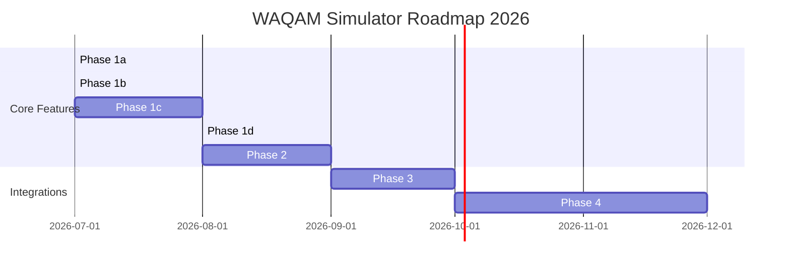

# 🗺️ WAQAM Simulator & Engine Roadmap

**Stand:** 2026-07-25 · **Engagement:** `eng:waqam-doku` · **Projekt-ROADMAP:** [`ROADMAP.md`](ROADMAP.md) (dieses Dokument)

Diese Roadmap dokumentiert die geplanten funktionalen, mathematischen und vertrieblichen Weiterentwicklungen des **WAQAM (Weighted Architecture Quality Assessment Model)** Simulators. Sie dient als Leitfaden für die Produktentwicklung und das Beratungsteam.

---

## 🎯 Strategische Meilensteine

---

## 🚀 Detaillierte Phasen & Features
*Details und Ausführungspläne für die nächsten Schritte siehe im aktuellen [Implementierungsplan](./implementation_plan.md).*

### Phase 1a: Mathematischer Validator & QA-Sicherheitsnetz
* **Ziel:** Absicherung der stochastischen Berechnungslogik gegen mathematische Anomalien und Instabilität durch automatisierte Boundary- und Monotonie-Prüfungen.
* **Geplante Features:**
  * **Erhaltungssatz-Prüfer:** Verifikation, dass das Gesamttransaktionsvolumen $V$ stets erhalten bleibt ($\text{Dunkel} + \text{HITL} + \text{Fehlbuchungen}$).
  * **Monotonie-Tester:** Skriptbasierter Check, ob Eingabe-Verschlechterungen (z. B. sinkendes $Q$, steigendes $U$) streng monoton fallende Pass-Rates zur Folge haben.
  * **Klassen-TCO-Verifikator:** Automatisierte Plausibilisierung der wirtschaftlichen TCO-Rechnungen.

### Phase 1b: Schrittweise Komplexitätsrechnung (Step-level SCI & `implType`)
* **Ziel:** Umstellung der Simulationsrechnung von einer pauschalen globalen Bewertung auf eine schrittweise Wahrscheinlichkeitskette basierend auf dem Step Complexity Index (SCI) und dem Implementierungstyp pro Schritt.
* **Geplante Features:**
  * **Schrittspezifische Stochastik:** Einbindung von $I$ (Informationsdichte), $R$ (Regeln), $S$ (Schnittstellen) und $C$ (Kognition) pro Schritt zur dynamischen Ermittlung der Schritt-Fehlerrate.
  * **Implementierungstyp pro Schritt:** Berücksichtigung von `deterministic`, `ai` und `agentic` pro Schritt inklusive spezifischer Token-, Latenz- und Fehler-Modifikatoren.

### Phase 1c: Dynamischer Prozess-Pipeline-Viewer (Folie 2 & Folie 4)
* **Ziel:** Visualisierung der physischen Zielarchitektur und Implementierungs-Technologie pro Schritt auf Slide 4 basierend auf der aktiven Klasse.
* **Geplante Features:**
  * **Interaktives Sizing-Dashboard:** Visualisierung und Bearbeitbarkeit der Schritt-Komplexität (S, M, L, XL) direkt im Simulator (Slide 3).
  * **Farbkodierte Boxen-Pipeline (Slide 4):** Dynamischer Wechsel der Boxen-Farbe, Icons und Tech-Labels (Grau = `Standard-ABAP`, Grün = `Hybrid-AI + Gate`, Violett = `KI-Agent`) je nach gewählter Systemklasse.

### Phase 1d: Mathematische Transparenz & Visualisierung des Halluzinations-Modells
* **Ziel:** Die im Hintergrund rechnende Bayes-Stochastik für IT-Entscheider, Wirtschaftsprüfer und Mathematiker auf Kundenseite grafisch transparent und nachvollziehbar machen.
* **Geplante Features:**
  * **Interaktiver Stochastik-Explorer:** Ein Dashboard-Widget, das zeigt, wie sich die Einzelregel-Konfidenz basierend auf Datenqualität ($Q$) und Unstrukturierung ($U$) verhält.
  * **Fehlerfortpflanzungs-Kurve:** Grafische Darstellung der Formel $P_{\text{pass}} = (1 - p_{\text{fail}})^{\text{total\_checks}}$ zur Veranschaulichung, warum die Fehlerwahrscheinlichkeit mit steigender Regelanzahl ($N$) und Belegpositionen ($P$) exponentiell wächst.
  * **Sicherheitsnetz-Effekt:** Vorher-Nachher-Vergleich der Fehlerkurven, der visuell beweist, dass das Validation Gate die Fehlerrate im SAP-Kern auf unter 0,1 % drückt.

### Phase 2: Die TCO-Grenzkosten-Matrix & Plattform-Vergleich (Marketing- & Vertriebs-Hebel)
* **Ziel:** Ein mächtiges Beratungswerkzeug zur sofortigen Wirtschaftlichkeitsbewertung der verschiedenen WAQAM-Klassen auf CFO-Ebene und Gegenüberstellung von Hosting-Plattformen.
* **Geplante Features:**
  * **Dynamisches TCO-Kipppunkt-Diagramm:** Interaktive 2D/3D-Grafik, die den finanziellen Break-Even-Point zwischen den Klassen visualisiert (z. B. ab welchem monatlichen Belegvolumen $V$ die hohen CAPEX-Kosten eines autonomen Agenten der Klasse 3 die OPEX-Kosten von Klasse 2 überholen).
  * **BTP vs. Agnostisch TCO-Vergleich:** Interaktive Gegenüberstellung der transaktionsbasierten Lizenzkosten von SAP BTP (Generative AI Hub, Build Process Automation) gegenüber den geringeren OPEX-Kosten einer agnostischen, selbst gehosteten Agenten-Plattform (z. B. auf AWS/Azure mit Open-Source-LLMs).
  * **Sensitivitäts-Matrix:** Darstellung der Gesamtkosten pro Buchung in Abhängigkeit vom Unstrukturierungsgrad.
  * **Vertriebs-Export:** Einseitiges PDF-Handout für den Kunden, das den wirtschaftlichen Wendepunkt grafisch für seine konkreten Zahlen aufbereitet.

### Phase 3: Multi-Workflow Konsolidierung
* **Ziel:** Parallel-Simulation mehrerer Kundenprozesse in einer einzigen Gesamtübersicht.
* **Geplante Features:**
  * **Enterprise Dashboard:** Aggregation von z. B. 5 verschiedenen Workflows (Onboarding, Retouren, CAPEX etc.) zu einer konsolidierten jährlichen FTE-Ersparnis und Gesamt-TCO.
  * **Portfolio-Ansicht:** Priorisierungsmatrix, die dem Kunden zeigt, bei welchen seiner Prozesse die KI-Automatisierung den höchsten ROI erzielt.

### Phase 4: API-Import von Realkanal-Daten (Celonis & SAP Signavio)
* **Ziel:** Eliminierung von Schätzungen durch direkten Daten-Import aus den Quellsystemen des Kunden.
* **Geplante Features:**
  * **Process-Mining-Koppelung:** Automatisierter Import von Prozessdaten aus Celonis oder SAP Signavio zur exakten Befüllung der Parameter $V$ (Volumen) und $SLA$ (tatsächliche Durchlaufzeiten).
  * **Eingangs-Profiler:** Analyse einer Stichprobe echter Kundendokumente zur automatischen Berechnung von $U$ (Unstrukturierungsgrad) und $Q$ (Datenqualität).
