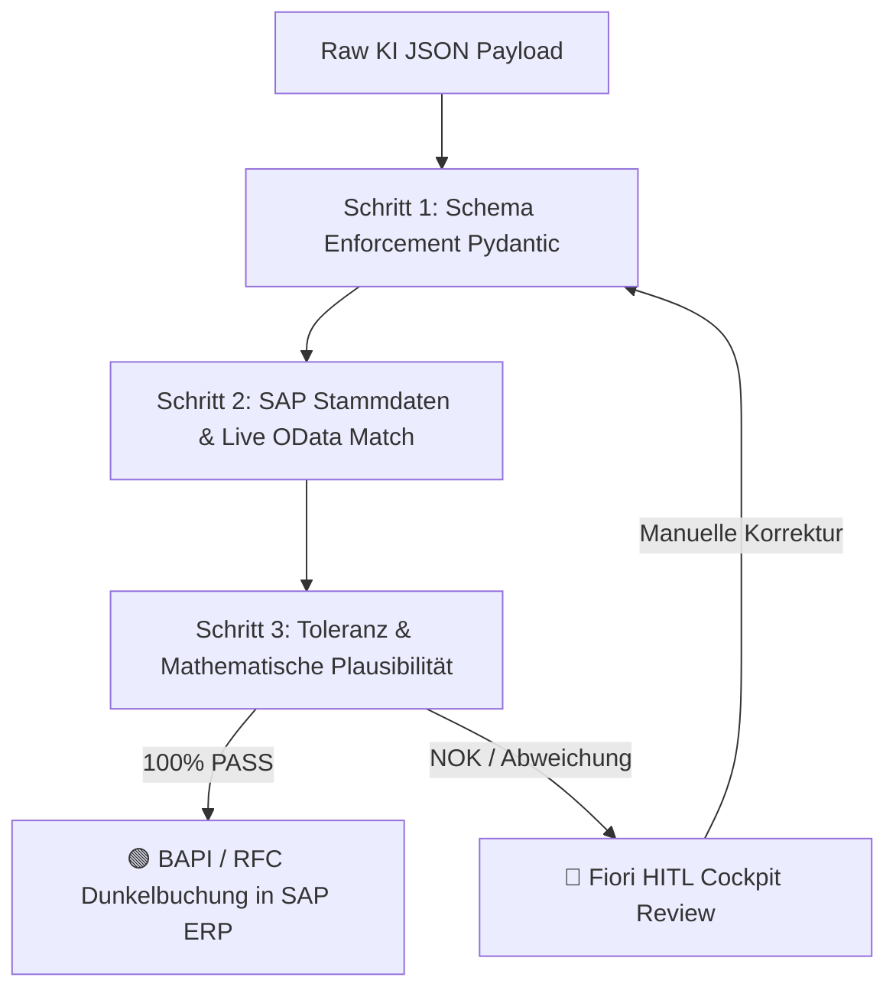

# 📘 SAP AI Enterprise Governance & WAQAM Engine – Das Große Berater- & Architekten-Handbuch

**Version 3.5 · Stand: Juni 2026**  
**Herausgeber: PBD EXPERTS Enterprise Architecture Board**  
**Zielgruppe: Senior SAP Consultants, Enterprise Architects, CFOs, IT-Auditoren & Wirtschaftsprüfer**

---

## 📋 Inhaltsverzeichnis
1. [📚 Begriff-Index & Glossar (Vollständiges Schnell-Nachschlagewerk)](#-1-begriff-index--glossar-vollständiges-schnell-nachschlagewerk)
2. [🏛️ Strategisches Ziel & Die 4 WAQAM Betriebsmodi](#-2-strategisches-ziel--die-4-waqam-betriebsmodi)
3. [🖥️ Detaillierter Anwendungs-Walkthrough & Element-Führer](#-3-detaillierter-anwendungs-walkthrough--element-führer)
   * [3.1 Folie 1: Executive Briefing & Use Case Selection](#31-folie-1-executive-briefing--use-case-selection)
   * [3.2 Folie 2: Visual Process Canvas & SA2 Architecture Blueprint](#32-folie-2-visual-process-canvas--sa2-architecture-blueprint)
   * [3.3 Folie 3: WAQAM Live-Simulator & CFO Executive Audit](#33-folie-3-waqam-live-simulator--cfo-executive-audit)
   * [3.4 🛡️ CFO Risk & Governance Popover Modal (Interaktive Risiko-Ampel)](#34--cfo-risk--governance-popover-modal-interaktive-risiko-ampel)
   * [3.5 💡 Interaktive Sofort-Hover Tooltips](#35--interaktive-sofort-hover-tooltips)
   * [3.6 Folie 4: Board Governance Audit Zertifikat & SOLL-Blueprint](#36-folie-4-board-governance-audit-zertifikat--soll-blueprint)
4. [🛡️ Die Architektur des SA2 Validation Gate](#-4-die-architektur-des-sa2-validation-gate)
5. [🧮 Mathematische Engine & Stochastische Konfidenz-Formeln](#-5-mathematische-engine--stochastische-konfidenz-formeln)
6. [📊 Revisions- & Audit-Leitfaden für Wirtschaftsprüfer](#-6-revisions--audit-leitfaden-für-wirtschaftsprüfer)

---

## 📚 1. Begriff-Index & Glossar (Vollständiges Schnell-Nachschlagewerk)

Dieses Glossar dient Beratern im Kundengespräch als lückenloses Nachschlagewerk für alle verwendeten Abkürzungen, Architektur-Konzepte und Finanz-Kennzahlen:

### 🧠 KI-, Governance- & Architektur-Begriffe
* **WAQAM (Workload Architecture & Quality Assessment Model):** Das mathematische Entscheidungsmodell zur Klassifizierung von KI-Workloads im SAP-Umfeld in 4 Betriebsmodi (Klasse 0 bis 3) basierend auf Unstrukturierungsgrad, SLA-Latenz und Konfidenz.
* **Validation Gate (Pydantic Rule Check):** Deterministisches Prüfmodul auf der SAP BTP. Untersucht KI-Payloads stufenweise auf Schema-Konformität, Stammdaten-Match und Toleranzen vor dem Schreibzugriff auf das SAP ERP.
* **HITL (Human-in-the-Loop):** Manuelle Nachbearbeitung risikobehafteter oder unvollständiger Belege im SAP Fiori My Inbox Cockpit durch Fachbearbeiter (Vier-Augen-Prinzip).
* **Dunkelverarbeitung (Straight-Through Processing / STP):** Prozentualer Anteil der Belege, die das Validation Gate mit 100% Konfidenz passieren und vollautomatisch per BAPI im SAP ERP gebucht werden.
* **Model Drift:** Das Phänomen, dass externe LLMs nach Anbieter-Updates ihr Verhalten ändern. Das Validation Gate fungiert hier als 100%ige Brandmauer gegen ERP-Re-Testing.
* **Multi-LLM Hub:** Abstraktionsschicht auf SAP AI Core Orchestration Services. Erlaubt den nahtlosen Wechsel zwischen OpenAI, Claude, Vertex AI oder Llama 3 ohne Code-Änderungen in S/4HANA (0% Vendor Lock-in).
* **Zero Data Retention (ZDR):** Vertragliche Garantie von SAP AI Core, dass übermittelte Finanz- und Kundendaten nach der Extraktion sofort gelöscht und niemals für externes Modelltraining verwendet werden.

### 💰 CFO- & Finanz-Kennzahlen
* **CAPEX (Capital Expenditures):** Einmaliges Projekt- & Implementierungs-Investment für Konzeption, BTP-Gateway-Setup und Testen.
* **OPEX (Operational Expenditures):** Laufende monatliche Betreuungs-, Governance-, Tenant- und Monitoring-Kosten.
* **Amortisationszeit (Payback-Period):** Zeitraum in Monaten, bis sich das CAPEX-Investment durch die Einsparung von manuellen Handarbeitskosten vollständig refinanziert hat.
* **Reelle Gesamtkosten / Beleg (€/Buchung):** Ganzheitliche kaufmännische Buchungskosten pro Beleg, berechnet als: $(\text{Handarbeit} + \text{KI-Tokens} + \text{Residualschaden} + \text{OPEX}) \div \text{Monatsvolumen}$.
* **Residualschaden (Restrisiko):** Erwarteter monatlicher Schadenswert durch verbleibende Restfehler nach dem Validation Gate.

### 🏛️ SAP-, Schnittstellen- & Revisions-Standards
* **IDW PS 880 / ISAE 3000:** Prüfungsstandards für IT-Systeme zur offiziellen Revisions-Zertifizierung und Vorstands-Freigabe.
* **CDHDR / CDPOS:** Die zentralen SAP-Datenbanktabellen für Änderungsbelege. Garantiert einen lückenlosen Audit-Trail für jede KI-Buchung.
* **BAPI (Business Application Programming Interface):** Standardisierte SAP-RFC-Schnittstelle für objektorientierte, transaktionale Schreibzugriffe in S/4HANA.
* **Clean Core:** SAP-Architektur-Prämissen, nach denen kundenindividuelle Logik und KI-Erweiterungen strikt auf der SAP BTP abgelegt werden, um das S/4HANA ERP upgradefähig zu halten.

---

## 🏛️ 2. Strategisches Ziel & Die 4 WAQAM Betriebsmodi

Das **WAQAM (Workload Architecture & Quality Assessment Model)** schützt Unternehmen vor Fehlinvestitionen und Haftungsrisiken bei KI-Projekten. Bei allen Betriebsmodi ist das Validation Gateway mandatorisch vorgeschaltet:

| Architektur-Klasse | Bezeichnung | Beschreibung & Technologische Einordnung | Schwellenwerte & Auslöser |
|---|---|---|---|
| **Klasse 0** | ⚙️ **Deterministisch (ABAP / No-AI)** | Klassische SAP ABAP / RPA Logik. Keine KI zulässig oder erforderlich. | SLA-Latenz ≤ 2,0s ODER Unstrukturierung ≤ 10% |
| **Klasse 1** | 🔹 **Point-AI Extraktion (1-Step)** | Punktueller KI-Einsatz für isolierte Einzelschritte (z.B. OCR-Texterfassung aus PDFs), gefolgt von starrer ABAP-Verarbeitung. | Unstrukturierung 11% bis 35% |
| **Klasse 2** | 🟢 **Hybrid-AI (SA2 Enterprise Standard)** | Der hybride Enterprise-Standard. KI-Modelle extrahieren Daten, kombiniert mit deterministischem Validation Gate & Fiori HITL-Cockpit. | Unstrukturierung 36% bis 59%, SLA ≥ 2s *(Enterprise Sweet Spot)* |
| **Klasse 3** | 🟣 **Autonomer Agent (Multi-Step ReAct)** | Autonome Multi-Step Agenten mit ReAct-Tool-Loops. Erforderlich bei sehr hohem Unstrukturierungsgrad am Eingang. | Unstrukturierung ≥ 60% AND SLA ≥ 6,0s |

---

## 🖥️ 3. Detaillierter Anwendungs-Walkthrough & Element-Führer

---

### 3.1 Folie 1: Executive Briefing & Use Case Selection

Folie 1 dient als Einstieg in den Kunden-Workshop. Hier definiert der Berater gemeinsam mit dem Vorstand den zu transformierenden SAP-Kernprozess.

#### 🎛️ Bedienungselemente & Funktionen auf Folie 1:
1. **SAP Modul Dropdown (Oben in der Kopfzeile):**
   * *Funktion:* Ermöglicht den Umschalt-Wechsel zwischen vorbereiteten Enterprise-Anwendungsfällen (*UC01: Lieferanten-Rechnungsprüfung (FI/MM)*, *UC02: Kunden-Auftragserfassung (SD)*, *UC03: Banf-Genehmigung (MM/CO)*, etc.).
   * *Auswirkung:* Lädt sofort die spezifischen Prozessschritte, Stammdaten-Tabellen und Standard-Parameter des jeweiligen Moduls.
2. **Use Case Briefing Card (Links):**
   * *Funktion:* Zeigt die funktionale Beschreibung des Geschäftsprozesses sowie den primären betriebswirtschaftlichen Auslöser (Trigger).
3. **AS-IS Ausgangslage & Historisches Schadenspotenzial (Rechts):**
   * *Funktion:* Visualisiert die manuelle Ist-Situation des Kunden ohne KI-Unterstützung.
   * *Kennzahlen:* Zeigt die bisherige Bearbeitungszeit pro Beleg (z.B. 12 Minuten Handarbeit), den bisherigen Stundensatz des Fachbereichs (62,50 €/Std.) und das historische jährliche Fehlerpotenzial durch Tippfehler bei manueller Erfassung.
4. **Button "Prozess-Workflow analysieren ➔" (Unten rechts):**
   * *Funktion:* Navigiert direkt zu Folie 2 (Visual Process Canvas). alternativ kann die Tastatur-Pfeiltaste `➔` genutzt werden.

---

### 3.2 Folie 2: Visual Process Canvas & SA2 Architecture Blueprint

Folie 2 stellt die 5 Prozessschritte des ausgewählten Use Cases visuell dar und beweist dem Kunden, wie die KI nahtlos in die SAP Clean Core Architektur integriert wird.

#### 🎛️ Bedienungselemente & Funktionen auf Folie 2:
1. **IST-Prozesskette (Oberer Pfad, 5 Karten):**
   * *Funktion:* Zeigt die 5 klassischen Schritte der manuellen Sachbearbeitung (z.B. *01: Posteingang ➔ 02: Datenabtippen ➔ 03: Bestellabgleich ➔ 04: Freigabe ➔ 05: SAP Buchung*).
   * *Interaktion:* Klick auf eine beliebige Karte hebt diese hervor und zeigt rechts die detaillierte IST-Beschreibung.
2. **SOLL-Zielarchitektur Canvas (Unterer Pfad, 5 Karten mit BTP-Brücke):**
   * *Funktion:* Visualisiert die automatisierte Ziel-Prozesskette unter Einsatz von SAP AI Core und dem Validation Gate.
3. **Das Validation Gate Sicherheitsnetz (Hervorgehobenes Schild zwischen Schritt 2 und 3):**
   * *Funktion:* Zeigt dem Kunden und Wirtschaftsprüfer plastisch, dass die KI niemals direkt in die S/4HANA Datenbank schreiben darf, sondern zwingend die deterministische Pydantic-Prüfung passieren muss.
4. **Button "Live-ROI Simulator starten ➔" (Unten rechts):**
   * *Funktion:* Navigiert zu Folie 3 (dem Haupt-Simulations-Dashboard).

---

### 3.3 Folie 3: WAQAM Live-Simulator & CFO Executive Audit

Folie 3 ist das Herzstück des Gesamtsystems. Hier werden kaufmännische und technische Stellschrauben live simuliert.

#### 🎛️ Bedienungselemente & Stellschrauben (Linke Spalte):

1. **🏆 Button "Optimale Variante (Enterprise Sweet Spot)":**
   * *Funktion:* 1-Klick Schnell-Setzung aller Parameter auf die maximal wirtschaftliche Klasse 2 Konfiguration (25.000 Belege, 50% Unstrukturiert, 8,0s SLA).
2. **🎯 Business-Szenarien Schnellschalter (1. Max. Dunkelverarbeitung, 2. Express-Durchlauf, 3. Minimal-Invest / OCR):**
   * *Funktion:* Verändert mit einem Klick die Regler-Kombinationen für spezifische Kunden-Ziele.
3. **⚙️ Button "Architektur-Grenzwerte erzwingen...":**
   * *Funktion:* Öffnet ein Untermenü zur manuelle Fixierung von Klasse 0, Klasse 1 oder Klasse 3.
4. **🔒 Lock-Banner (Architektur-Fixierung):**
   * *Funktion:* Erscheint, sobald eine Klasse fixiert wurde. Zeigt die aktiven Grenzen und bietet einen Button `Freischalten` zur Aufhebung.
5. **Regler "Monatliches Volumen (V)":**
   * *Spanne:* 1.000 bis 100.000 Belege/Monat.
   * *Auswirkung:* Skaliert die absoluten Einsparungen und beschleunigt die Amortisation.
6. **Regler "Unstrukturierungs-Grad (U)":**
   * *Spanne:* 0% bis 100%. *(Wird bei aktiven Smart Locks dynamisch auf Klassengrenzen beschränkt!)*
   * *Auswirkung:* Bestimmt, ob ABAP (≤10%), Point-AI (≤35%), Hybrid-AI (≤59%) oder Agenten (≥60%) empfohlen werden.
7. **Regler "Prozess-Komplexität (N)":**
   * *Spanne:* 3 bis 30 Prüfregeln.
   * *Auswirkung:* Bildet die fachliche Komplexität ab. Regeln ($N$) dämpfen stochastisch die Dunkelquote. Werte $\ge 15$ weisen in Kombination mit unstrukturierten Daten auf Klasse 3 (Agentic) hin.
8. **Regler "Ø Positionen pro Beleg (P)":**
   * *Spanne:* 1 bis 30 Zeilen/Dokument.
   * *Auswirkung:* Exponentieller Dämpfer für die Dunkelquote, da jede zusätzliche Tabellenzeile das Risiko eines Einzelfehlers erhöht.
9. **Regler "Max. SLA-Latenz (Sek.)":**
   * *Spanne:* 1,0s bis 30,0s.
   * *Auswirkung:* Werte ≤ 2,0s erzwingen Klasse 0 (ABAP), da KI-Modelle Latenzen von ca. 3-8s aufweisen.
10. **Untermenü "Weitere IT-Details anpassen...":**
   * *Regler Daten-Qualität (Q):* 10% bis 100%. Beeinflusst die Bayes-Konfidenz der Erst-Extraktion.
   * *Eingabefeld Ø Schaden pro Fehler / Fehlerkosten:* Prozesstyp-abhängiges finanzielles Risiko bei unbemerkten Fehlern (Fehlerkosten).
   * *Eingabefeld Token-Preis (€ / 1M):* LLM-Kosten bei SAP AI Core. In Klasse 0 automatisch auf 0,00 € deaktiviert.

> [!NOTE]
> **Das methodische Parameter-Design (Stand Juni 2026):**
> Um eine objektive Vergleichbarkeit zu gewährleisten, teilen sich alle 15 Use Cases einheitliche **Standard-Kunden-Parameter** (Defaults: 25.000 Belege, 50% U, 80% Q, 8s SLA, 5 Positionen).
> Die fachliche Unterscheidung der Prozesse erfolgt **ausschließlich** über:
> 1. **`rules_count` (N):** Prozesskomplexität (z.B. 12 bei AP-Invoice, 22 bei Clean Core, 4 bei Archivierung).
> 2. **`cost_per_error`:** Fehlerkosten des Prozesstyps (z.B. 25 € bei Standard-Rechnungen, 500 € bei regulatorischen DSGVO-Archiv-Risiken).
> Dies sorgt für mathematisch und kaufmännisch valide Business Cases ohne künstliche Verzerrung.

#### 📊 Ergebniskarten (Rechte Spalte oben):
* **Dunkelverarbeitung (%):** Zeigt die errechnete automatische Durchbuchungsquote (z.B. ~85%).
* **Reelle Handarbeit / Mo (€):** Verbleibende Personalkosten für manuelle HITL-Prüfungen im Fiori Cockpit.
* **KI-Betriebskosten / Mo (€):** Reine LLM Token-Kosten bei SAP AI Core.
* **Gesamtkosten / Beleg (€/Buchung):** Echte Gesamtkosten pro Buchung inkl. Handarbeit, Tokens, OPEX und Restrisiko.

#### 🏢 Executive Audit Matrix (Rechte Spalte Mitte):
* *Funktion:* 4-Spalten-Vergleich aller Betriebsmodi (Klasse 0, 1, 2, 3). Zeigt Zeile für Zeile die Gesamtkosten, CAPEX, OPEX und Amortisationszeit (Payback in Monaten).
* *Risiko-Ampel-Buttons:* Interaktive Buttons (`🟢 GRÜN`, `🟢/🟡 GERING`, `🟢 SWEET SPOT`, `🔴 HOCH`). Klick öffnet das Risiko-Modal.

---

### 3.4 🛡️ CFO Risk & Governance Popover Modal (Interaktive Risiko-Ampel)

Beim Klick auf einen der Risiko-Ampel Buttons öffnet sich das gutachterliche Risiko-Protokoll.

#### 🎛️ Inhalte & Argumentations-Führer im Modal:
* **🟢 SWEET SPOT (Klasse 2 - Hybrid-AI):**  
  Beweist dem CFO 0% Vendor Lock-in durch den SAP AI Core Multi-LLM Hub, 100% Model Drift Firewall (kein teures SAP ERP Re-Testing nach LLM-Updates) und IDW PS 880 Testat-Fähigkeit durch lückenlose LMK-Tabellen in `CDHDR`/`CDPOS`.
* **🔴 HOCH (Klasse 3 - Voll-Agentisch):**  
  Warnt den CFO vor unkalkulierbaren OPEX-Kosten (3.800 €/Mo), hohen CAPEX (160.000 €) und Bedenken von Wirtschaftsprüfern bezüglich der GoBD-Konformität bei dynamischen ReAct-Tool-Loops.

---

### 3.5 💡 Interaktive Sofort-Hover Tooltips

Fährt der Benutzer mit der Maus über ein Fragezeichen (`❓`) bei den Parametern, schweb sofort ein dunkles Glassmorphism-Helpcard ein.

* **Funktion:** Verhindert das lästige Aufklicken von Untermenüs und erklärt dem Berater im Bruchteil einer Sekunde die genaue mathematische und kaufmännische Bedeutung des jeweiligen Reglers.

---

### 3.6 Folie 4: Board Governance Audit Zertifikat & SOLL-Blueprint

Folie 4 liefert die zertifizierte Management-Zusammenfassung für den Aufsichtsrat.

#### 🎛️ Bedienungselemente & Funktionen auf Folie 4:
1. **Gutachterliche Freigabe-Card (Oben):**
   * *Funktion:* Offizielles Zertifizierungs-Siegel für die empfohlene Architektur-Klasse.
2. **Live Simulation Summary Cards (Mitte):**
   * *Funktion:* Zeigt komprimiert die 4 Schlüsselwerte aus Folie 3 (Dunkelverarbeitung %, Handarbeit €, Tokens €, Kosten/Beleg €).
3. **Errechneter KI-Zielarchitektur Blueprint Canvas:**
   * *Funktion:* Interaktive 5-Schritte Prozesskette. Klick auf einen Schritt öffnet darunter ein Detail-Fenster mit konkreten System-Komponenten, Aufgaben und Governance-Prüfungen.
4. **Gutachterliche Erläuterungen (4 Textblöcke):**
   * *Inhalt:* Detaillierte Stellungnahme zu Haftungsfreiheit, Wirtschaftlichkeit, Multi-LLM Hub und EU AI Act Datensouveränität.
5. **Button "PDF Drucken / Exportieren" (Oben rechts):**
   * *Funktion:* Triggert den Browser-Druckdialog für den sauberen Export des Zertifikats als Board-Vorlage.

---

## 🛡️ 4. Die Architektur des SA2 Validation Gate

---

## 🧮 5. Mathematische Engine & Stochastische Konfidenz-Formeln

Die WAQAM-Engine errechnet die Konfidenz $C$ und die Dunkelverarbeitung auf Basis der Bayesschen Wahrscheinlichkeit:

$$C = Q \cdot (1 - 0.5 \cdot U)$$

$$\text{Volume} = \text{AutoVolume} + \text{HitlVolume} + \text{ErrorVolume}$$

> [!IMPORTANT]
> **Stochastisches Komplexitäts-De-Rating für Klasse 3 (Agentic Workflow):**
> In der Realität können autonome Agentic-Selbstkorrekturschleifen (Klasse 3) ihre Stärken nur dann ausspielen, wenn der Prozess eine hinreichende fachliche Komplexität aufweist (Prüfregeln $N \ge 15$). 
> Bei einfachen Prozessen ($N < 15$) ist die Fehlerwahrscheinlichkeit $p_{\text{fail}}$ von Klasse 3 identisch mit Klasse 2, da ein Agent ohne komplexe Verzweigungen und Tool-Verketten keinen stochastischen Vorteil gegenüber einer Standard-Hybrid-Extraktion erzielen kann.
> * Mathematische Zuweisung in der Engine:
>   * Für $N \ge 15: \quad p_{\text{fail\_K3}} = p_{\text{fail\_base}} \cdot 0.25$  (75% Reduktion durch Self-Correction Loops)
>   * Für $N < 15: \quad p_{\text{fail\_K3}} = p_{\text{fail\_base}} \cdot 0.75$  (25% Reduktion durch Self-Correction Loops bei einfacheren Regeln)

> [!NOTE]
> **Wirtschaftlichkeits-Schwellenwerte basierend auf Monatsvolumen (V):**
> Die mathematische Empfehlungs-Engine berücksichtigt neben der technischen Eignung auch die wirtschaftliche Verhältnismäßigkeit. Bei geringen oder mittleren Belegmengen werden komplexe Architekturen automatisch de-eskaliert:
> * **$V < 2.000$ (Sehr geringes Volumen):** Die Engine stuft Empfehlungen für Klasse 2/3 auf **Klasse 0 (No-AI)** (bei vorwiegend strukturierten Daten, $U \le 35\%$) oder **Klasse 1 (Point-AI)** herab.
> * **$2.000 \le V < 6.000$ (Mittleres Volumen):** Eine technische Empfehlung für Klasse 3 (Agentic) wird automatisch auf **Klasse 2 (Hybrid-AI)** herabgestuft, da sich der zusätzliche Wartungs- und Koordinationsaufwand eines Agenten bei dieser Menge wirtschaftlich noch nicht amortisiert.

---

## 📊 6. Revisions- & Audit-Leitfaden für Wirtschaftsprüfer

Für die erfolgreiche Systemprüfung nach **IDW PS 880 / ISAE 3000** fordert der Auditor den Nachweis der Ordnungsmäßigkeit (GoBD). Das SA2 Framework garantiert dies durch:

1. **Deterministisches Pydantic Gate:** Keine KI-Entscheidung gelangt ungeprüft in die Buchhaltung.
2. **Unveränderbarer Audit Trail:** Jede automatische Verbuchung schreibt Änderungsbelege in den SAP-Standardtabellen `CDHDR` (Kopf) und `CDPOS` (Positionen) unter Angabe des KI-Service-Users und des Konfidenz-Scores.
3. **Zero Data Retention (ZDR):** Nachweisbare vertragliche Zusicherung der SAP SE, dass Kundendaten auf BTP Frankfurt nicht persistent gespeichert oder verarbeitet werden.

---
*PBD EXPERTS SA2 Governance Framework · All Rights Reserved 2026*
