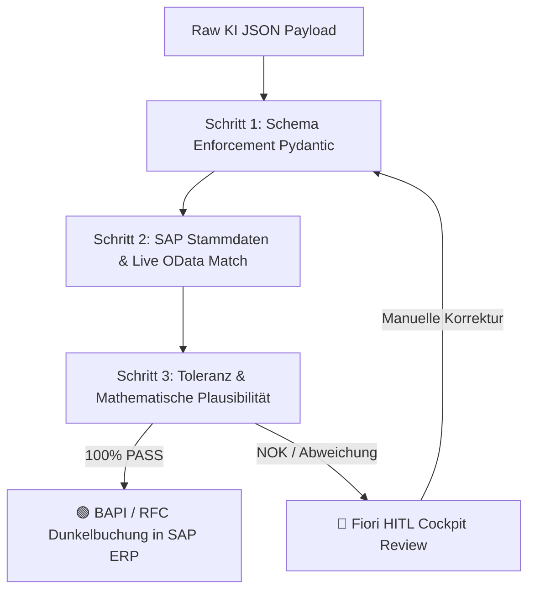

# 📘 SAP AI Enterprise Governance & WAQAM Engine – Das Große Berater- & Architekten-Handbuch

**Version 3.5 · Stand: Juli 2026**  
**Herausgeber: PBD EXPERTS Enterprise Architecture Board**  
**Zielgruppe: Senior SAP Consultants, Enterprise Architects, CFOs, IT-Auditoren & Wirtschaftsprüfer**

---

## 📋 Inhaltsverzeichnis
1. [📚 Begriff-Index & Glossar (Vollständiges Schnell-Nachschlagewerk)](#-1-begriff-index--glossar-vollständiges-schnell-nachschlagewerk)
2. [🏛️ Strategisches Ziel & Die 4 WAQAM Betriebsmodi](#-2-strategisches-ziel--die-4-waqam-betriebsmodi)
3. [🖥️ Detaillierter Anwendungs-Walkthrough & Element-Führer](#-3-detaillierter-anwendungs-walkthrough--element-führer)
   * [3.1 Folie 1: Executive Briefing & Use Case Selection](#31-folie-1-executive-briefing--use-case-selection)
   * [3.2 Folie 2: Visual Process Canvas & SA2 Architecture Blueprint](#32-folie-2-visual-process-canvas--sa2-architecture-blueprint)
   * [3.3 Folie 3: WAQAM Live-Simulator & CFO Executive Audit](#33-folie-3-waqam-live-simulator--cfo-executive-audit)
   * [3.4 🛡️ CFO Risk & Governance Popover Modal (Interaktive Risiko-Ampel)](#34--cfo-risk--governance-popover-modal-interaktive-risiko-ampel)
   * [3.5 💡 Interaktive Sofort-Hover Tooltips](#35--interaktive-sofort-hover-tooltips)
   * [3.6 Folie 4: Board Governance Audit Zertifikat & SOLL-Blueprint](#36-folie-4-board-governance-audit-zertifikat--soll-blueprint)
4. [🛡️ Die Architektur des SA2 Validation Gate](#-4-die-architektur-des-sa2-validation-gate)
5. [🧮 Mathematische Engine & Stochastische Konfidenz-Formeln](#-5-mathematische-engine--stochastische-konfidenz-formeln)
6. [📊 Revisions- & Audit-Leitfaden für Wirtschaftsprüfer](#-6-revisions--audit-leitfaden-für-wirtschaftsprüfer)

---

## 📚 1. Begriff-Index & Glossar (Vollständiges Schnell-Nachschlagewerk)

Dieses Glossar dient Beratern im Kundengespräch als lückenloses Nachschlagewerk für alle verwendeten Abkürzungen, Architektur-Konzepte und Finanz-Kennzahlen:

### 🧠 KI-, Governance- & Architektur-Begriffe
* **WAQAM (Workload Architecture & Quality Assessment Model):** Das mathematische Entscheidungsmodell zur Klassifizierung von KI-Workloads im SAP-Umfeld in 4 Betriebsmodi (Klasse 0 bis 3) basierend auf Unstrukturierungsgrad, SLA-Latenz und Konfidenz.
* **Validation Gate (Pydantic Rule Check):** Deterministisches Prüfmodul auf der SAP BTP. Untersucht KI-Payloads stufenweise auf Schema-Konformität, Stammdaten-Match und Toleranzen vor dem Schreibzugriff auf das SAP ERP.
* **HITL (Human-in-the-Loop):** Manuelle Nachbearbeitung risikobehafteter oder unvollständiger Belege im SAP Fiori My Inbox Cockpit durch Fachbearbeiter (Vier-Augen-Prinzip).
* **Dunkelverarbeitung (Straight-Through Processing / STP):** Prozentualer Anteil der Belege, die das Validation Gate mit 100% Konfidenz passieren und vollautomatisch per BAPI im SAP ERP gebucht werden.
* **Model Drift:** Das Phänomen, dass externe LLMs nach Anbieter-Updates ihr Verhalten ändern. Das Validation Gate fungiert hier als 100%ige Brandmauer gegen ERP-Re-Testing.
* **Multi-LLM Hub:** Abstraktionsschicht auf SAP AI Core Orchestration Services. Erlaubt den nahtlosen Wechsel zwischen OpenAI, Claude, Vertex AI oder Llama 3 ohne Code-Änderungen in S/4HANA (0% Vendor Lock-in).
* **Zero Data Retention (ZDR):** Vertragliche Garantie von SAP AI Core, dass übermittelte Finanz- und Kundendaten nach der Extraktion sofort gelöscht und niemals für externes Modelltraining verwendet werden.

### 💰 CFO- & Finanz-Kennzahlen
* **CAPEX (Capital Expenditures):** Einmaliges Projekt- & Implementierungs-Investment für Konzeption, BTP-Gateway-Setup und Testen.
* **OPEX (Operational Expenditures):** Laufende monatliche Betreuungs-, Governance-, Tenant- und Monitoring-Kosten.
* **Amortisationszeit (Payback-Period):** Zeitraum in Monaten, bis sich das CAPEX-Investment durch die Einsparung von manuellen Handarbeitskosten vollständig refinanziert hat.
* **Reelle Gesamtkosten / Beleg (€/Buchung):** Ganzheitliche kaufmännische Buchungskosten pro Beleg, berechnet als: $(\text{Handarbeit} + \text{KI-Tokens} + \text{Residualschaden} + \text{OPEX}) \div \text{Monatsvolumen}$.
* **Residualschaden (Restrisiko):** Erwarteter monatlicher Schadenswert durch verbleibende Restfehler nach dem Validation Gate.

### 🏛️ SAP-, Schnittstellen- & Revisions-Standards
* **IDW PS 880 / ISAE 3000:** Prüfungsstandards für IT-Systeme zur offiziellen Revisions-Zertifizierung und Vorstands-Freigabe.
* **CDHDR / CDPOS:** Die zentralen SAP-Datenbanktabellen für Änderungsbelege. Garantiert einen lückenlosen Audit-Trail für jede KI-Buchung.
* **BAPI (Business Application Programming Interface):** Standardisierte SAP-RFC-Schnittstelle für objektorientierte, transaktionale Schreibzugriffe in S/4HANA.
* **Clean Core:** SAP-Architektur-Prämissen, nach denen kundenindividuelle Logik und KI-Erweiterungen strikt auf der SAP BTP abgelegt werden, um das S/4HANA ERP upgradefähig zu halten.

---

## 🏛️ 2. Strategisches Ziel & Die 4 WAQAM Betriebsmodi

Das **WAQAM (Workload Architecture & Quality Assessment Model)** schützt Unternehmen vor Fehlinvestitionen und Haftungsrisiken bei KI-Projekten. Bei allen Betriebsmodi ist das Validation Gateway mandatorisch vorgeschaltet:

| Architektur-Klasse | Bezeichnung | Beschreibung & Technologische Einordnung | Schwellenwerte & Auslöser |
|---|---|---|---|
| **Klasse 0** | ⚙️ **Deterministisch (ABAP / No-AI)** | Klassische SAP ABAP / RPA Logik. Keine KI zulässig oder erforderlich. | SLA-Latenz ≤ 2,0s ODER Unstrukturierung ≤ 10% |
| **Klasse 1** | 🔹 **Point-AI Extraktion (1-Step)** | Punktueller KI-Einsatz für isolierte Einzelschritte (z.B. OCR-Texterfassung aus PDFs), gefolgt von starrer ABAP-Verarbeitung. | Unstrukturierung 11% bis 35% |
| **Klasse 2** | 🟢 **Hybrid-AI (SA2 Enterprise Standard)** | Der hybride Enterprise-Standard. KI-Modelle extrahieren Daten, kombiniert mit deterministischem Validation Gate & Fiori HITL-Cockpit. | Unstrukturierung 36% bis 59%, SLA ≥ 2s *(Enterprise Sweet Spot)* |
| **Klasse 3** | 🟣 **Autonomer Agent (Multi-Step ReAct)** | Autonome Multi-Step Agenten mit ReAct-Tool-Loops. Erforderlich bei sehr hohem Unstrukturierungsgrad am Eingang. | Unstrukturierung ≥ 60% AND SLA ≥ 6,0s |

---

## 🖥️ 3. Detaillierter Anwendungs-Walkthrough & Element-Führer

### 3.1 Folie 1: Executive Briefing & Use Case Selection
Folie 1 dient als Einstieg in den Kunden-Workshop. Hier definiert der Berater gemeinsam mit dem Vorstand den zu transformierenden SAP-Kernprozess.

#### 🎛️ Bedienungselemente & Funktionen auf Folie 1:
1. **SAP Modul Dropdown (Oben in der Kopfzeile):** Modul-Auswahl der Enterprise-Anwendungsfälle (z.B. *UC01*, *UC02*, etc.). Lädt sofort die spezifischen Prozessschritte und Parameter.
2. **Use Case Briefing Card (Links):** Funktionale Beschreibung des ausgewählten Geschäftsprozesses.
3. **AS-IS Ausgangslage & Historisches Schadenspotenzial (Rechts):** Visualisiert die manuelle Ist-Situation des Kunden (Bearbeitungszeit, Stundensatz des Fachbereichs und Fehlerkosten).
4. **Button "Prozess-Workflow analysieren ➔" (Unten rechts):** Navigiert direkt zu Folie 2 (Visual Process Canvas).

### 3.2 Folie 2: Visual Process Canvas & SA2 Architecture Blueprint
Folie 2 stellt die 5 Prozessschritte des ausgewählten Use Cases visuell dar und beweist dem Kunden, wie die KI nahtlos in die SAP Clean Core Architektur integriert wird.

#### 🎛️ Bedienungselemente & Funktionen auf Folie 2:
1. **IST-Prozesskette (Oberer Pfad, 5 Karten):** Zeigt die 5 klassischen Schritte der manuellen Sachbearbeitung. Klick auf eine Karte hebt diese hervor.
2. **SOLL-Zielarchitektur Canvas (Unterer Pfad, 5 Karten mit BTP-Brücke):** Visualisiert die automatisierte Ziel-Prozesskette unter Einsatz von SAP AI Core und dem Validation Gate.
3. **Das Validation Gate Sicherheitsnetz (Hervorgehobenes Schild zwischen Schritt 2 und 3):** Zeigt dem Kunden plastisch, dass die KI niemals direkt in die ERP-Datenbank schreiben darf.
4. **Button "Live-ROI Simulator starten ➔" (Unten rechts):** Navigiert zu Folie 3 (dem Haupt-Simulations-Dashboard).

### 3.3 Folie 3: WAQAM Live-Simulator & CFO Executive Audit
Folie 3 ist das Herzstück des Gesamtsystems. Hier werden kaufmännische und technische Stellschrauben live simuliert.

#### 🎛️ Bedienungselemente & Stellschrauben (Linke Spalte):
1. **🏆 Button "Optimale Variante (Sweet Spot)":** 1-Klick Schnell-Setzung aller Parameter auf die standardmäßig wirtschaftliche Klasse 2 Konfiguration.
2. **🎯 Business-Szenarien Schnellschalter:** Verändert mit einem Klick die Regler-Kombinationen für spezifische Kunden-Ziele (Max. Dunkelverarbeitung, Express, Minimal-Invest).
3. **⚙️ Button "Architektur-Grenzwerte erzwingen...":** Ermöglicht die manuelle Fixierung von Klasse 0, 1, 2 oder 3.
4. **Regler "Monatliches Volumen (V)":** 1.000 bis 100.000 Belege/Monat.
5. **Regler "Unstrukturierungs-Grad (U)":** 0% bis 100%.
6. **Regler "Prozess-Komplexität (N)":** 3 bis 30 Prüfregeln.
7. **Regler "Ø Positionen pro Beleg (P)":** 1 bis 30 Zeilen/Dokument.
8. **Regler "Max. SLA-Latenz (Sek.)":** 1,0s bis 30,0s (Werte ≤ 2,0s erzwingen Klasse 0 ABAP).
9. **Untermenü "Weitere IT-Details anpassen...":** Regler für Daten-Qualität ($Q$), Fehlerkosten und Token-Preise.

> [!NOTE]
> **Das methodische Parameter-Design:**
> Um eine objektive Vergleichbarkeit zu gewährleisten, teilen sich alle 15 Use Cases einheitliche **Standard-Kunden-Parameter** (Defaults: 25.000 Belege, 50% U, 80% Q, 8s SLA, 5 Positionen). Die fachliche Unterscheidung der Prozesse erfolgt **ausschließlich** über die Prozesskomplexität ($N$) und die Fehlerkosten.

#### 📊 Ergebniskarten (Rechte Spalte oben):
* **Dunkelverarbeitung (%):** Errechnete automatische Durchbuchungsquote.
* **Reelle Handarbeit / Mo (€):** Verbleibende Personalkosten für manuelle HITL-Prüfungen.
* **KI-Betriebskosten / Mo (€):** Reine LLM Token-Kosten bei SAP AI Core.
* **Gesamtkosten / Beleg (€/Buchung):** Echte Gesamtkosten pro Buchung inkl. Handarbeit, Tokens, OPEX und Restrisiko.

#### 🏢 Executive Audit Matrix & Risiko-Ampel:
* 4-Spalten-Vergleich aller Betriebsmodi (Klasse 0, 1, 2, 3) bezüglich Gesamtkosten, CAPEX, OPEX und Payback.
* Risiko-Ampel-Buttons (`🟢 GRÜN`, `🟢/🟡 GERING`, `🟢 SWEET SPOT`, `🔴 HOCH`) öffnen das detaillierte Risiko-Modal.

### 3.4 🛡️ CFO Risk & Governance Popover Modal (Interaktive Risiko-Ampel)
Gutachterliches Risiko-Protokoll bei Klick auf die Risiko-Ampel:
* **🟢 SWEET SPOT (Klasse 2 - Hybrid-AI):** Beweist 0% Vendor Lock-in, 100% Model Drift Firewall und GoBD/IDW PS 880 Testat-Fähigkeit durch CDHDR/CDPOS Änderungsbelege.
* **🔴 HOCH (Klasse 3 - Voll-Agentisch):** Warnt vor unkalkulierbaren OPEX-Kosten, hohem CAPEX und Bedenken bezüglich GoBD-Prüfungen bei dynamischen ReAct-Tool-Loops.

### 3.5 💡 Interaktive Sofort-Hover Tooltips
Fährt der Benutzer mit der Maus über ein Fragezeichen (`❓`), schwebt sofort eine Glassmorphism-Hilfekarte ein, um den Parameter fachlich zu erklären.

### 3.6 Folie 4: Board Governance Audit Zertifikat & SOLL-Blueprint
Zusammenfassung für den Aufsichtsrat. Bietet eine gutachterliche Freigabekarte, komprimierte Kennzahlen, die detaillierte Soll-Prozesskette mit anwählbaren Schritten sowie einen PDF-Export-Button für Gremienvorlagen.

---

## 🛡️ 4. Die Architektur des SA2 Validation Gate

---

## 🧮 5. Mathematische Engine & Stochastische Konfidenz-Formeln

Die WAQAM-Engine simuliert die Dunkelverarbeitung, Latenz und Kosten auf Basis eines **schrittweisen, seriellen stochastischen Modells**. Anstatt den Prozess monolithisch zu bewerten, wird die Prozesskette als Sequenz von Einzelschritten simuliert.

### 5.1 Schrittweise Komplexitäts-Modellierung (4D-Modell)
Jeder Prozessschritt $i$ in der Belegflusskette wird über 4 Dimensionen bewertet:
1.  **Informationsdichte ($I_i \in [1, 5]$):** Komplexität der zu extrahierenden Freitexte und Felder.
2.  **Regelkomplexität ($R_i \in [1, 5]$):** Anzahl und Tiefe der logischen Verzweigungen in diesem Schritt.
3.  **Schnittstellentiefe ($S_i \in [1, 5]$):** Anzahl der angebundenen Systeme und API-Aufrufe (z.B. OData, RFC, REST).
4.  **Kognitiver Faktor ($C_i \in [1, 5]$):** Kognitiver Interpretationsaufwand für die KI bzw. den Sachbearbeiter.

Aus der Summe dieser Dimensionen ergibt sich der **Step Complexity Index (SCI)** für diesen Schritt:
$$\text{SCI}_i = I_i + R_i + S_i + C_i \quad \in [4, 20]$$

### 5.2 Einzelschritt-Konfidenz & Kognitive Dämpfung
Die Basis-Konfidenz der Erst-Extraktion wird durch die Datenqualität am Eingang ($Q$) und den Unstrukturierungsgrad ($U$) definiert:
$$\text{mean\_confidence\_base} = Q \cdot 0{,}70 + (1{,}0 - U) \cdot 0{,}30$$

Für jeden Einzelschritt $i$ wird diese Konfidenz durch den kognitiven Faktor ($C_i$) und die Systemgrenzen ($S_i$) stochastisch gedämpft:
$$\text{Confidence Modifier}_i = 1{,}0 - (C_i - 1) \cdot 0{,}05 - (S_i - 1) \cdot 0{,}03$$
$$\text{mean\_confidence\_step}_i = \text{mean\_confidence\_base} \cdot \text{Confidence Modifier}_i$$

Daraus ergibt sich die schrittweise Fehlerrate der KI-Verarbeitung:
$$p_{\text{fail\_step}_i} = (1{,}0 - \text{mean\_confidence\_step}_i) \cdot 0{,}08$$

### 5.3 Implementierungstypen pro Schritt (`implType`)
Jeder Schritt besitzt einen technologischen Typ, welcher das Latenz-, Token- und Fehlerrate-Verhalten steuert:

#### A. Deterministisch (`deterministic`)
*   Reiner Regelcode (z.B. ABAP-Prüfung, SAP Standard-Workflow).
*   **Token-Kosten:** $0{,}00 \text{ €}$
*   **Fehlerwahrscheinlichkeit:** Konstant $0{,}01\%$ (nahezu fehlerfrei).
*   **Latenz:** < $0{,}5\text{s}$.

#### B. Hybrid-AI (`ai`)
*   Punktuelle KI-Extraktion.
*   **Token-Kosten:** Standard-Tokenverbrauch basierend auf Unstrukturierung.
*   **Fehlerwahrscheinlichkeit:** $p_{\text{fail\_step}_i}$.
*   **Latenz:** Standard-KI-Verarbeitungszeit.

#### C. Autonomer Agent (`agentic`)
*   ReAct-Loops zur selbstständigen Fehlerkorrektur und Validierung.
*   **Token-Kosten:** 1,8x Multiplikator auf den Basis-Tokenverbrauch.
*   **Fehlerwahrscheinlichkeit:** Drastische Reduktion durch Feedback-Schleifen:
    *   Wenn Regeln $N \ge 15$: $p_{\text{fail\_step}_i} \cdot 0{,}25$ (75% Fehlerreduktion)
    *   Wenn Regeln $N < 15$: $p_{\text{fail\_step}_i} \cdot 0{,}75$ (25% Fehlerreduktion)
*   **Latenz:** Erhöht durch iterative Loops (+ $1{,}5\text{s}$ pro Schritt).

### 5.4 Serielle Durchlaufwahrscheinlichkeit (Erhaltungssatz)
Die Gesamtwahrscheinlichkeit, dass ein Beleg den Prozess vollautomatisch (Dunkelverarbeitung) ohne Fehler durchläuft, entspricht dem Produkt der Einzelschritt-Erfolge:
$$P_{\text{auto\_pass}} = \prod_{i=1}^{S} (1 - p_{\text{fail\_step}_i})^{\text{checks\_step}_i}$$

Hierbei entspricht $\text{checks\_step}_i$ den gewichteten Prüfschritten des Schritts $i$ (aufgeteilt in Kopf- und Positionsregeln).

Die Belege werden stochastisch aufgeteilt in:
*   **Dunkelverarbeitung (Auto-Booking):** $\text{Volume} \cdot P_{\text{auto\_pass}}$
*   **Fehlerrate (Residualrisiko):** $\text{Volume} \cdot (1{,}0 - P_{\text{auto\_pass}}) \cdot \text{LeakageRate}$
*   **HITL-Routing (Fiori Arbeitsvorrat):** $\text{Volume} \cdot (1{,}0 - P_{\text{auto\_pass}}) \cdot (1{,}0 - \text{LeakageRate})$

*Der Erhaltungssatz ist zu jedem Zeitpunkt erfüllt:*
$$\text{Volume} \equiv \text{AutoVolume} + \text{HitlVolume} + \text{ErrorVolume}$$

### 5.5 Wirtschaftlichkeits-Schwellenwerte basierend auf Monatsvolumen (V)
Die mathematische Empfehlungs-Engine berücksichtigt neben der technischen Eignung auch die wirtschaftliche Verhältnismäßigkeit. Bei geringen oder mittleren Belegmengen werden komplexe Architekturen automatisch de-eskaliert:
*   **$V < 2.000$ (Sehr geringes Volumen):** Die Engine stuft Empfehlungen für Klasse 2/3 auf **Klasse 0 (No-AI)** (bei vorwiegend strukturierten Daten, $U \le 35\%$) oder **Klasse 1 (Point-AI)** herab.
*   **$2.000 \le V < 6.000$ (Mittleres Volumen):** Eine technische Empfehlung für Klasse 3 (Agentic) wird automatisch auf **Klasse 2 (Hybrid-AI)** herabgestuft, da sich der zusätzliche Wartungs- und Koordinationsaufwand eines Agenten bei dieser Menge wirtschaftlich noch nicht amortisiert.

---

## 📊 6. Revisions- & Audit-Leitfaden für Wirtschaftsprüfer

Für die erfolgreiche Systemprüfung nach **IDW PS 880 / ISAE 3000** fordert der Auditor den Nachweis der Ordnungsmäßigkeit (GoBD). Das SA2 Framework garantiert dies durch:

1. **Deterministisches Pydantic Gate:** Keine KI-Entscheidung gelangt ungeprüft in die Buchhaltung.
2. **Unveränderbarer Audit Trail:** Jede automatische Verbuchung schreibt Änderungsbelege in den SAP-Standardtabellen `CDHDR` (Kopf) und `CDPOS` (Positionen) unter Angabe des KI-Service-Users und des Konfidenz-Scores.
3. **Zero Data Retention (ZDR):** Nachweisbare vertragliche Zusicherung der SAP SE, dass Kundendaten auf BTP Frankfurt nicht persistent gespeichert oder verarbeitet werden.

---
*PBD EXPERTS SA2 Governance Framework · All Rights Reserved 2026*
