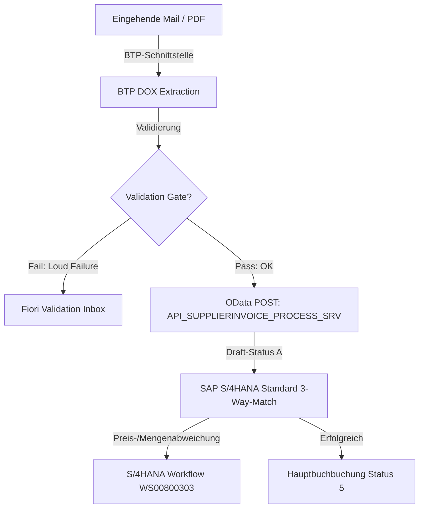
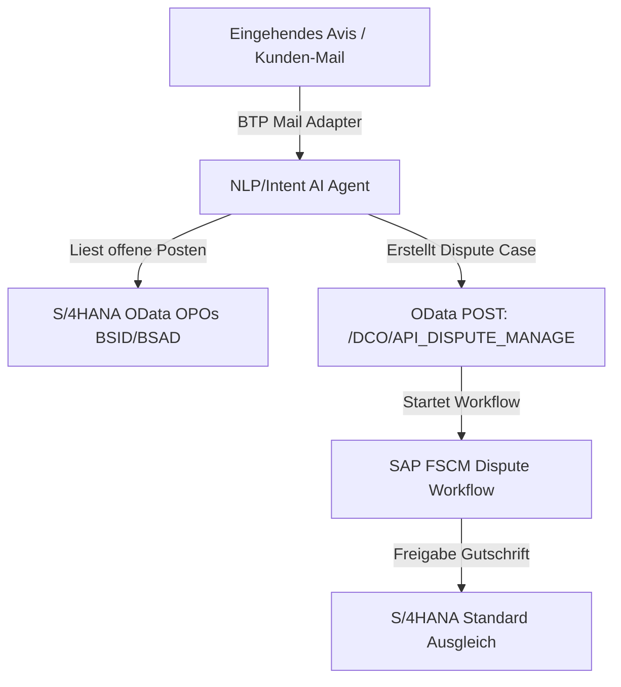
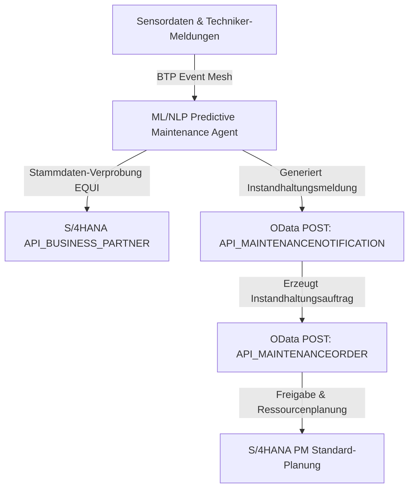
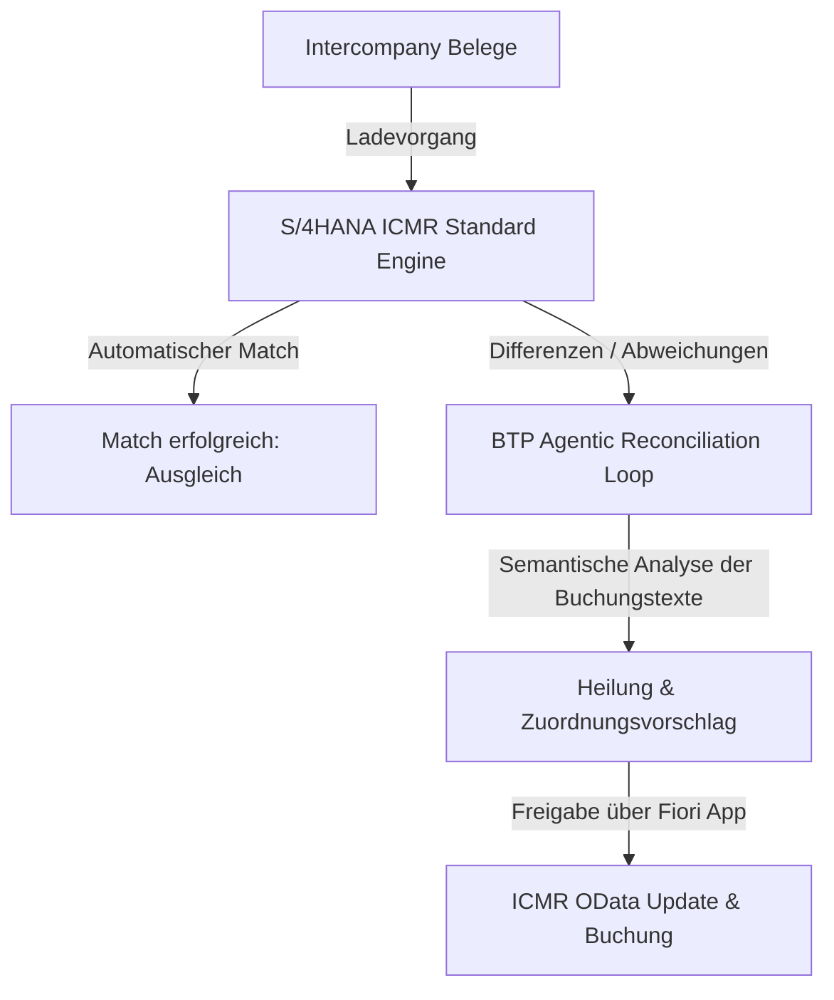
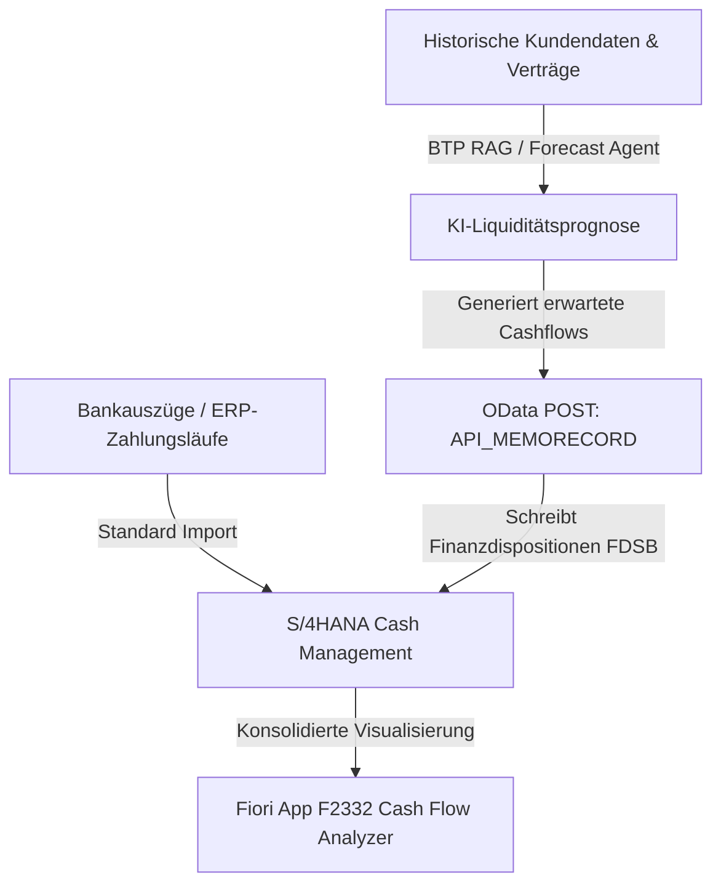

# 📑 SAP S/4HANA Standard-Mapping & Delta-Analyse (WAQAM Use-Cases)

Dieses Dokument bietet eine strukturierte Gegenüberstellung der 15 WAQAM Use-Cases mit dem offiziellen **SAP S/4HANA Standard**. Es dient als Diskussionsgrundlage für die Prozessgestaltung im Rahmen des Workshops.

---

## 📊 Master-Tabelle: Alle 15 Use-Cases im SAP-Standard

| ID | WAQAM Use-Case | SAP S/4HANA Scope-Item | Standard SAP OData API / Interface | SAP Accelerator Hub Link | SAP Help Portal Link |
|---|---|---|---|---|---|
| **UC01** | Accounts Payable (Rechnungseingang) | **J60** (Accounts Payable)<br>**4N6** (Invoice Processing CIM)<br>**1JD** (Supplier Invoice Processing) | `API_SUPPLIERINVOICE_PROCESS_SRV` | [API Hub](https://api.sap.com/api/API_SUPPLIERINVOICE_PROCESS_SRV/overview) | [SAP Help](https://help.sap.com/docs/SAP_S4HANA_CLOUD?q=Invoice+Processing+with+Central+Invoice+Management+4N6) |
| **UC02** | Dispute Resolution (AR) | **1D0** (Receivables Dispute Management) | `/DCO/API_DISPUTE_MANAGE` (OData v4)<br>`API_CADISPUTECASE` | [API Hub](https://api.sap.com/api/API_CADISPUTECASE/overview) | [SAP Help](https://help.sap.com/docs/SAP_S4HANA_CLOUD?q=Dispute+Management+1D0) |
| **UC03** | IDoc & Interface Migration | **1ED** (Subsystem Integration) | SAP Integration Suite APIs | [API Hub](https://api.sap.com/search?q=IDoc+Integration) | [SAP Help](https://help.sap.com/docs/SAP_S4HANA_CLOUD?q=Integration+with+Subsystems+1ED) |
| **UC04** | Predictive Maintenance | **BH1** (Corrective Maintenance)<br>**4HH** (Reactive Maintenance) | `API_MAINTENANCEORDER`<br>`API_MAINTENANCENOTIFICATION` | [API Hub](https://api.sap.com/api/API_MAINTENANCEORDER/overview) | [SAP Help](https://help.sap.com/docs/SAP_S4HANA_CLOUD?q=Maintenance+Order+BH1) |
| **UC05** | Procurement Contract Compliance | **1KI** (Purchase Contract)<br>**J13** (Operational Procurement) | `API_PURCHASECONTRACT_PROCESS_SRV`<br>`API_PURCHASEORDER_PROCESS_SRV` | [API Hub](https://api.sap.com/api/API_PURCHASECONTRACT_PROCESS_SRV/overview) | [SAP Help](https://help.sap.com/docs/SAP_S4HANA_CLOUD?q=Purchase+Contract+1KI) |
| **UC06** | Custom Code Remediation | **55I** (Custom Code Migration) | BTP Custom Code Migration App | [BTP Hub](https://api.sap.com/search?q=Custom+Code+Migration) | [SAP Help](https://help.sap.com/docs/SAP_S4HANA_CLOUD?q=Custom+Code+Migration+55I) |
| **UC07** | B2B EDI Partner Onboarding | **1BD** (B2B Message Exchange) | Integration Suite Trading Partner Mgmt | [API Hub](https://api.sap.com/search?q=Trading+Partner+Management) | [SAP Help](https://help.sap.com/docs/SAP_S4HANA_CLOUD?q=B2B+EDI+Trading+Partner+Management+1BD) |
| **UC08** | Intercompany Reconciliation | **40Y** (Intercompany Matching & Rec.) | ICMR OData Engine / CDS APIs | [API Hub](https://api.sap.com/api/MATCHINGITEMBULKCREATEREQUEST_/overview) | [SAP Help](https://help.sap.com/docs/SAP_S4HANA_CLOUD?q=ICMR+40Y) |
| **UC09** | Intelligent Data Archiving | **1GD** (Data Archiving)<br>**1J2** (Information Lifecycle Mgmt) | SAP ILM / Standard Archiving Suite | [API Hub](https://api.sap.com/search?q=Data+Archiving) | [SAP Help](https://help.sap.com/docs/SAP_S4HANA_CLOUD?q=Information+Lifecycle+Management+1J2) |
| **UC10** | Supply Chain Risk & Sourcing | **1A2** (Strategic Sourcing)<br>**3LK** (Supplier Risk) | SAP Ariba APIs / Supplier Risk | [API Hub](https://api.sap.com/search?q=Ariba+Supplier+Risk) | [SAP Help](https://help.sap.com/docs/SAP_S4HANA_CLOUD?q=Supplier+Risk+3LK) |
| **UC11** | Sales Order Automation | **4X9** (Sales Order from Unstructured)<br>**BD9** (Sell from Stock) | `API_SALES_ORDER_SRV` | [API Hub](https://api.sap.com/api/API_SALES_ORDER_SRV/overview) | [SAP Help](https://help.sap.com/docs/SAP_S4HANA_CLOUD?q=Create+Sales+Orders+from+Unstructured+Data+4X9) |
| **UC12** | Master Data Governance (MDG) | **1N1** (MDG Customer)<br>**1N2** (MDG Supplier) | `API_BUSINESS_PARTNER` | [API Hub](https://api.sap.com/api/API_BUSINESS_PARTNER/overview) | [SAP Help](https://help.sap.com/docs/SAP_S4HANA_CLOUD?q=Master+Data+Governance+1N1) |
| **UC13** | HR Onboarding Orchestration | **1JB** (SuccessFactors Integration) | SuccessFactors Employee Central API | [API Hub](https://api.sap.com/api/EC_Onboarding/overview) | [SAP Help](https://help.sap.com/docs/SAP_S4HANA_CLOUD?q=SuccessFactors+Onboarding+1JB) |
| **UC14** | Service Ticket Routing | **3D5** (Service Order Management) | `API_SERVICEORDER_SRV` | [API Hub](https://api.sap.com/api/API_SERVICE_ORDER_SRV/overview) | [SAP Help](https://help.sap.com/docs/SAP_S4HANA_CLOUD?q=Service+Order+Management+3D5) |
| **UC15** | Cash Flow Forecasting | **J59** (Cash Management) | `API_MEMORECORD` (OData)<br>`CASHFLOW_IN` (SOAP) | [API Hub](https://api.sap.com/api/API_MEMORECORD/overview) | [SAP Help](https://help.sap.com/docs/SAP_S4HANA_CLOUD?q=Cash+Management+J59) |

---

## 🔍 Deep-Dive & Delta-Analyse: Die 6 Kern-Workflows

Hier wird analysiert, wie sich der **Soll-Prozess mit KI** in den jeweiligen SAP-Standard integriert und welche Abweichungen (Deltas) zur bisherigen vereinfachten Beschreibung bestehen.

---

### 1. UC01: Accounts Payable (Eingangsrechnungs-Prüfung)

#### SAP Standardprozess (Scope-Item J60 / 4N6 / 1JD)
Rechnungen gehen per Mail/PDF ein. Die Standard-Erfassung erfolgt über das SAP Central Invoice Management (C CIM, Scope-Item 4N6) unter Nutzung des Document Information Extraction (DOX) Service. Ein vorläufiger Beleg (Draft/Parked, Status `"A"`) wird angelegt (Scope-Item 1JD). Der 3-Way-Match prüft die Abweichungen gegen Bestellung (PO) und Wareneingang (GR). Bei Preis-/Mengenfehlern sperrt S/4HANA die Buchung und startet den Standard-Workflow `WS00800303` (Klärung über Fiori Inbox).

#### Visualisierung des Soll-Prozesses (mit KI-Extension)


#### Delta-Analyse (Was fehlt in der aktuellen Doku?)
*   **BTP vs. ERP Validierung:** Die aktuelle Beschreibung vermischt das BTP Validation Gate (strukturelle Validierung, z.B. IBAN-Format, Pflichtfelder) mit dem ERP-seitigen 3-Way-Match (kaufmännische Prüfung). 
*   **Parked/Posted Status:** BTP führt standardmäßig keinen direkten Post auf das Hauptbuch (`Status 5`) aus, sondern parkt den Beleg (`Status A`), damit der S/4HANA Kern seine native Governance-Prüfung machen kann.

---

### 2. UC02: Dispute Resolution & Deductions (AR Klärungen)

#### SAP Standardprozess (Scope-Item 1D0)
Zahlungsabzüge von Debitoren erzeugen einen offenen Posten auf dem Debitorenkonto. Im SAP Standard wird manuell ein **Dispute Case (Klärungsfall)** angelegt. Dieser verknüpft die offene Rechnung, den Zahlungsbeleg und ordnet Zuständigkeiten zu.

#### Visualisierung des Soll-Prozesses (mit KI-Extension)


#### Delta-Analyse (Was fehlt in der aktuellen Doku?)
*   **Standard-Objekt "Dispute Case":** Die aktuelle Beschreibung stellt den Klärungsprozess als manuellen "Dreikampf" dar. S/4HANA besitzt jedoch mit der Tabelle `UDMCASEATTR` ein klar definiertes Standard-Objekt für Dispute Cases. Der KI-Agent muss dieses Objekt direkt per OData V4 API `/DCO/API_DISPUTE_MANAGE` anlegen, anstatt Belege "frei" im System hin- und herzuschieben.

---

### 3. UC04: Predictive Maintenance & Work Orders (PM)

#### SAP Standardprozess (Scope-Item BH1 / 4HH)
Fehlfunktionen von Maschinen erfordern eine Instandhaltungsmeldung (Notification, Tabelle `QMEL`), die manuell oder per Sensor (IoT) angelegt wird. Daraus wird ein Instandhaltungsauftrag (Maintenance Order, Tabelle `AUFK`) generiert, der Ressourcen blockiert und Kosten auf eine Kostenstelle kontiert.

#### Visualisierung des Soll-Prozesses (mit KI-Extension)


#### Delta-Analyse (Was fehlt in der aktuellen Doku?)
*   **Notification vs. Order:** Der KI-Agent darf nicht direkt einen Instandhaltungsauftrag erzeugen, ohne vorher die Meldung (Notification) anzulegen. Dies verletzt die Revisionssicherheit im PM.
*   **Stammdaten-Validierung:** Vor der API-Übergabe muss der Agent verifizieren, ob das Equipment (`EQUI`) und der Technische Platz (`IFLOT`) im S/4HANA-Standard existieren, sonst schlägt die API fehl.

---

### 4. UC08: Intercompany Reconciliation & Matching (FI-IC)

#### SAP Standardprozess (Scope-Item 40Y)
Konzerngesellschaften buchen Transaktionen untereinander. Zum Monatsabschluss müssen diese Belege abgeglichen werden. S/4HANA nutzt hierzu das integrierte Tool **ICMR (Intercompany Matching & Reconciliation)**. Die Belege werden über Regeln (Matching Rules) automatisch gepaart. Nicht zuordenbare Belege verbleiben in der Klärung.

#### Visualisierung des Soll-Prozesses (mit KI-Extension)


#### Delta-Analyse (Was fehlt in der aktuellen Doku?)
*   **ICMR Engine vs. Custom Agent:** Die aktuelle Beschreibung geht davon aus, dass die KI den gesamten Matching-Prozess abwickelt. Im Clean Core Standard macht das jedoch die S/4HANA ICMR Engine. Der KI-Agent dient **nur als Exception Handler**, um die unklaren Differenzen (z.B. unterschiedliche Währungsdifferenzen, Buchungstext-Mismatches) semantisch aufzulösen und dem Sachbearbeiter in der ICMR-Fiori-Oberfläche Vorschläge zu machen.

---

### 5. UC11: Sales Order Automation (PDF-to-Order)

#### SAP Standardprozess (Scope-Item 4X9)
Kundenbestellungen (PDF/Mail) werden empfangen. SAP bietet hierfür das Standard-Scope-Item **4X9 (Create Sales Orders from Unstructured Data)**. Dieses lädt die PDFs hoch (Fiori App `F4920` / `F8947` mit SAP Document AI), extrahiert die Daten und erstellt einen **Sales Order Request** (Draft). Der Vertriebsmitarbeiter prüft und gibt diesen als echten Kundenauftrag frei.

#### Visualisierung des Soll-Prozesses (mit KI-Extension)
```mermaid
graph TD
  A[Eingehende PDF-Bestellung] -->|Automatischer Mail-Upload| B[SAP Document AI (Scope-Item 4X9 / Fiori F8947)]
  B -->|Erstellt Draft/Request| C[S/4HANA Sales Order Request]
  C -->|Fehlende Materialnummer / Kunden-ID| D[BTP AI Semantic Matcher]
  D -->|Löst Kunden-/Material-Alias auf| E[Update Draft über API_SALES_ORDER_SRV]
  E -->|Freigabe durch Vertriebler| F[Kundenauftragsbuchung VBAK/VBAP]
```

#### Delta-Analyse (Was fehlt in der aktuellen Doku?)
*   **Natives SAP AI vs. Custom BTP Agent:** Die aktuelle Beschreibung impliziert einen vollständig selbstgebauten BTP-Extraktionsagenten. SAP S/4HANA bringt jedoch mit der App `F8947` (AI-Assisted Extraction) ein natives Feature mit, das direkt auf dem SAP Document AI Modell läuft. Die WAQAM-AI sollte hier als Erweiterung fungieren, die fehlende Stammdaten-Aliase (z.B. kundenspezifische Materialnummern) auflöst, um die Dunkelverarbeitungsrate der Standard-App zu erhöhen.

---

### 6. UC15: Cash Flow Forecasting & Treasury Matching (FI-TR)

#### SAP Standardprozess (Scope-Item J59)
Kontoauszüge werden über Swift importiert. Das S/4HANA Cash Management verarbeitet die Daten und stellt den Cash Flow im **Cash Flow Analyzer (F2332)** dar. Zukünftige geplante Zahlungen werden als **Memo Records (Finanzdispositionen, Tabelle FDSB)** erfasst, um die Liquiditätsprognose zu füttern.

#### Visualisierung des Soll-Prozesses (mit KI-Extension)


#### Delta-Analyse (Was fehlt in der aktuellen Doku?)
*   **S/4HANA Treasury Integration:** Die aktuelle Doku beschreibt den Prozess so, als ob die KI die gesamte Liquiditätsprognose isoliert berechnet und anzeigt. Im SAP-Standard gehört diese Auswertung in die Fiori-App **Cash Flow Analyzer (F2332)**. Die KI muss ihre Prognose-Daten (z.B. wann welcher Kunde voraussichtlich zahlt) als **Memo Records (Finanzdispositionen)** über die API `API_MEMORECORD` in das SAP Cash Management einspielen, damit sie dort im Standard-Reporting sichtbar werden.

---

## 🏁 Zusammenfassung & Diskussionspunkte für den Workshop

1.  **Die Rolle der KI ("Exception Handler" statt "System of Record"):** In fast allen Use-Cases zeigt sich, dass S/4HANA bereits über Standard-Datenstrukturen (Dispute Cases, Memo Records, Sales Order Requests, PM Notifications) verfügt. Die KI-Extension sollte diese Standard-APIs befüllen, anstatt eigene Parallel-Datenstrukturen auf BTP aufzubauen.
2.  **Schnittstellen-Architektur:** Alle Workflows sollten die offiziellen OData APIs des SAP Business Accelerator Hubs nutzen, um die **Clean Core Richtlinien** einzuhalten. Custom-Datenbanktabellen im ERP-Kern für KI-Zwischenstände sind zu vermeiden.
