# 🏛️ Detaillierte Technische Architektur: SA2 Validation Gate & SAP S/4HANA Integration

**Dokument-ID:** ARCH-SA2-VALGATE-2026  
**Status:** Freigegeben für Enterprise Architecture Board  
**Zielsysteme:** SAP S/4HANA (On-Premise & Cloud), SAP BTP, SAP AI Core

---

## 📐 1. End-to-End Zielarchitektur Diagramm

Das folgende Mermaid-Diagramm visualisiert die lückenlose technische Entkopplung zwischen der stochastischen KI auf der SAP BTP und den deterministischen Schreib-Schnittstellen in SAP S/4HANA:

```mermaid
graph TD
    subgraph INGESTION["📥 1. Multichannel Eingang & Orchestrierung"]
        A1[📄 PDF Rechnungen / Scans] --> A5[SAP Document Information Extraction]
        A2[📩 E-Mail Avise / Freitexte] --> A6[SAP Integration Suite / Event Mesh]
        A3[📝 Inspektionsberichte / Schichtbücher] --> A6
        A4[📡 Subsystem EDI / IDocs] --> A6
    end

    subgraph AI_CORE["🧠 2. SAP BTP AI Core Orchestration (Multi-LLM Hub)"]
        A5 --> B1[SAP AI Core Gateway]
        A6 --> B1
        B1 --> B2[Multi-LLM Adapter: OpenAI / Claude / Llama 3]
        B2 -->|Zero Data Retention ZDR| B3[Raw Extraktion JSON Payload]
    end

    subgraph VAL_GATE["🛡️ 3. SA2 Validation Gate (Pydantic Microservice auf SAP BTP)"]
        B3 --> C1[Step 1: Pydantic Schema Enforcement<br/>Typen, Pflichtfelder, Syntax]
        C1 -->|PASS| C2[Step 2: Live SAP Master Data Match<br/>OData v4 Call an S/4HANA]
        C1 -->|FAIL| C4[🔴 Gate Rejection Event]
        C2 -->|MATCH| C3[Step 3: Plausibilitäts- & Toleranz-Engine<br/>Beträge, MwSt, Skonto]
        C2 -->|NO-MATCH| C4
        C3 -->|FAIL| C4
    end

    subgraph SAP_S4HANA["💾 4. SAP S/4HANA ERP Core (Deterministische Ebene)"]
        C3 -->|🟢 100% PASS| D1[Transactional RFC / BAPI Call<br/>z.B. BAPI_SUPPLIERINVOICE_CREATE]
        D1 --> D2[(S/4HANA DB Tables<br/>BKPF / BSEG / EKKO / LFA1)]
        D1 --> D3[Unveränderbarer Audit Trail<br/>SAP Tabellen CDHDR & CDPOS]
    end

    subgraph HITL_COCKPIT["📋 5. Human-in-the-Loop Supervision Cockpit"]
        C4 --> E1[SAP Fiori My Inbox / Task Center]
        E1 -->|Fachbearbeiter Korrektur| C1
    end

    style VAL_GATE fill:#0f172a,stroke:#3b82f6,stroke-width:3px
    style SAP_S4HANA fill:#064e3b,stroke:#10b981,stroke-width:3px
    style HITL_COCKPIT fill:#4c1d95,stroke:#8b5cf6,stroke-width:2px
```

---

## 🔬 2. Detaillierte Ablaufbeschreibung der 5 Architektur-Schichten

### Schicht 1: Multichannel Ingestion (Eingangsebene)
Unstrukturierte Dokumente (PDFs, Mail-Freitexte, Messprotokolle) treffen über SAP CPI, Event Mesh oder das DMS im System ein. Es erfolgt eine Vorkonvertierung durch SAP Document Information Extraction.

### Schicht 2: SAP BTP AI Core Orchestration (Multi-LLM Hub)
Die Extraktion erfolgt über **SAP AI Core**. Über den Multi-LLM Hub wird das optimale Modell (z.B. GPT-4o für komplexe Layouts, Claude 3.5 für lange Verträge) dynamisch aufgerufen. 
* **Zero Data Retention (ZDR):** Die Daten werden ausschließlich im Arbeitsspeicher verarbeitet und vertraglich garantiert nach der Ausführung sofort gelöscht (DSGVO- & EU AI Act-konform).

### Schicht 3: Das SA2 Validation Gate (Das deterministische Sicherheitsnetz)
Das Gate ist als hochperformanter Microservice (Python FastAPI / Kyma Runtime) auf der SAP BTP deployed. Es führt 3 synchrone Prüfungen in < 150ms durch:
1. **Step 1: Pydantic Schema Enforcement:** Prüft, ob alle Pflichtfelder (IBAN, Netto, MwSt, Datum) vorhanden sind und exakten Datentypen entsprechen (`Decimal`, `ISO-Date`, `String`).
2. **Step 2: Live SAP Master Data Match:** Fragt über SAP Destination Services in Echtzeit via OData v4 die S/4HANA Stammdaten ab (Existiert Kreditor `LFA1`? Existiert Bestellung `EKKO`? Ist Equipment `EQUI` aktiv?).
3. **Step 3: Plausibilitäts- & Toleranz-Engine:** Prüft mathematische Gleichungen ($\text{Netto} + \text{Steuer} = \text{Brutto}$) und vergleicht Abweichungen gegen konfigurierte Freigabe-Toleranzen (z.B. $\pm 0,05\text{ €}$).

### Schicht 4: SAP S/4HANA ERP Core (Schreibebene)
* **🟢 Dunkelverarbeitung (PASS):** Bei 100%igem Match ruft das Gateway direkt die entsprechende BAPI oder OData API auf (z.B. `BAPI_SUPPLIERINVOICE_CREATE`). Die Verbuchung erfolgt in Millisekunden.
* **Unveränderbarer Audit-Trail (IDW PS 880):** Jede automatische Verbuchung schreibt sofort Änderungseinträge in die zentralen SAP-Standardtabellen `CDHDR` (Header) und `CDPOS` (Items) unter Angabe des KI-Service-Users und des Konfidenz-Scores.

### Schicht 5: SAP Fiori My Inbox Cockpit (HITL)
* **🔴 Abweichung (FAIL):** Ergibt die Prüfung einen Fehler oder ein Stammdaten-Mismatch, wird der Schreibbefehl zwingend blockiert. Der Vorgang landet automatisch im **SAP Fiori Task Center** des zuständigen Fachbearbeiters. Nach korrigierender Freigabe durch den Menschen durchläuft die Änderung erneut das Validation Gate.

---

## 📑 3. Übersicht der SAP-Schreib-Schnittstellen für alle 15 Use Cases

| UC-ID | Use Case Name | SAP Modul | SAP Schreib-Interface (Target API) | Betroffene SAP Tabellen |
|---|---|---|---|---|
| **UC01** | Accounts Payable | FI-AP | `BAPI_SUPPLIERINVOICE_CREATE` / OData | `BKPF`, `BSEG`, `LFA1` |
| **UC02** | Dispute Resolution | FI-AR | `BAPI_ACC_DOCUMENT_POST` | `BSAD`, `KNB1` |
| **UC03** | Interface Migration | BC-MID | `OData v4 Repost Services` | `EDIDC`, `EDIDS` |
| **UC04** | Predictive Maintenance | PM / EAM | `API_MAINTENANCEORDER` | `QMEL`, `AUFK`, `EQUI` |
| **UC05** | Procurement Compliance | MM-PUR | `API_PURCHASEORDER_PROCESS_SRV` | `EKKO`, `EKPO` |
| **UC06** | Expense Auditing | FI-TV | `BAPI_TRIP_POST_TO_FI` | `PTRV_HEAD`, `ROUIN` |
| **UC07** | Asset Capitalization | FI-AA | `API_FIXEDASSET_PROCESS_SRV` | `ANLA`, `ANLZ` |
| **UC08** | Banf Approval | MM-PUR | `BAPI_REQUISITION_CREATE` | `EBAN`, `EBKN` |
| **UC09** | Goods Receipt Discrepancy| MM-IM | `BAPI_GOODSMVT_CREATE` | `MKPF`, `MSEG` |
| **UC10** | Customer Sales Orders | SD-SLS | `BAPI_SALESORDER_CREATEFROMDAT2` | `VBAK`, `VBAP` |
| **UC11** | Credit Notes & Returns | SD-SLS | `API_CUSTOMERRETURN_PROCESS_SRV` | `VBAK`, `VBFA` |
| **UC12** | Production Exceptions | PP | `BAPI_PRODORD_CHANGE` | `AFKO`, `AFRU` |
| **UC13** | Business Partner MDG | MDG | `API_BUSINESS_PARTNER` | `BUT000`, `LFA1`, `KNA1` |
| **UC14** | HR Employee Onboarding | HCM / SF | `BAPI_EMPLOYEE_ENQUEUE` | `PA0001`, `PA0002` |
| **UC15** | Customs Trade Compliance| GTS | `/SAPSLL/API_6800_SYNCHRON_TR` | `/SAPSLL/CORDB` |

---
*PBD EXPERTS Enterprise Architecture Board · All Rights Reserved 2026*
