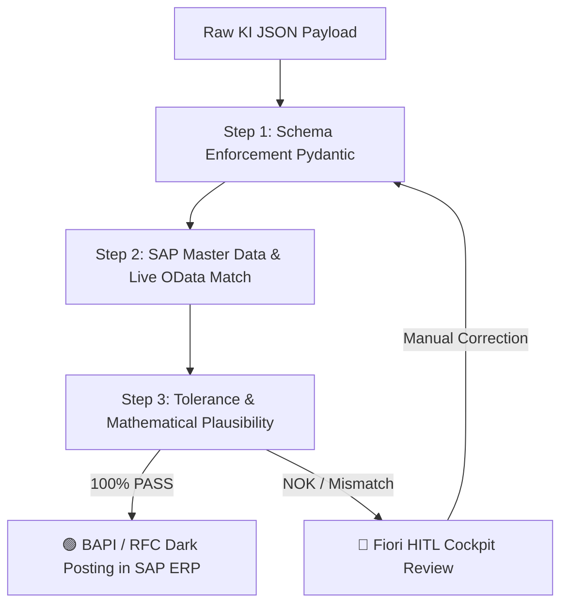

# 📘 SAP AI Enterprise Governance & WAQAM Engine – Comprehensive Architect & Consultant Handbook

**Version 3.5 · Status: June 2026**  
**Publisher: PBD EXPERTS Enterprise Architecture Board**  
**Target Audience: Senior SAP Consultants, Enterprise Architects, CFOs, IT Auditors & Certified Public Accountants**

---

## 📋 Table of Contents
1. [📚 Terminology Index & Glossary (Quick Reference Guide)](#-1-terminology-index--glossary-quick-reference-guide)
2. [🏛️ Strategic Objectives & The 4 WAQAM Operational Modes](#-2-strategic-objectives--the-4-waqam-operational-modes)
3. [🖥️ Detailed Application Walkthrough & UI Control Guide](#-3-detailed-application-walkthrough--ui-control-guide)
   * [3.1 Slide 1: Executive Briefing & Use Case Selection](#31-slide-1-executive-briefing--use-case-selection)
   * [3.2 Slide 2: Visual Process Canvas & SA2 Architecture Blueprint](#32-slide-2-visual-process-canvas--sa2-architecture-blueprint)
   * [3.3 Slide 3: WAQAM Live Simulator & CFO Executive Audit](#33-slide-3-waqam-live-simulator--cfo-executive-audit)
   * [3.4 🛡️ CFO Risk & Governance Popover Modal (Interactive Traffic Lights)](#34--cfo-risk--governance-popover-modal-interactive-traffic-lights)
   * [3.5 💡 Interactive Instant-Hover Tooltips](#35--interactive-instant-hover-tooltips)
   * [3.6 Slide 4: Board Governance Audit Certificate & Target Blueprint](#36-slide-4-board-governance-audit-certificate--target-blueprint)
4. [🛡️ Architecture of the SA2 Validation Gate](#-4-architecture-of-the-sa2-validation-gate)
5. [🧮 Mathematical Engine & Stochastic Confidence Formulas](#-5-mathematical-engine--stochastic-confidence-formulas)
6. [📊 IT Auditor Compliance Guide (IDW PS 880, GoBD, SAP CDHDR/CDPOS)](#-6-it-auditor-compliance-guide-idw-ps-880-gobd-sap-cdhdrcdpos)

---

## 📚 1. Terminology Index & Glossary (Quick Reference Guide)

This glossary serves as a quick reference guide for SAP consultants during client meetings for all abbreviations, architecture concepts, and CFO financial metrics:

### 🧠 AI, Governance & Architecture Terms
* **WAQAM (Workload Architecture & Quality Assessment Model):** The mathematical decision model used to classify AI workloads in SAP environments across 4 operating modes (Class 0 to 3) based on unstructured ratio, SLA latency, and confidence.
* **Validation Gate (Pydantic Rule Check):** Deterministic validation module deployed on SAP BTP. Evaluates AI JSON payloads step-by-step for schema compliance, master data matches, and tolerance thresholds prior to SAP ERP write operations.
* **HITL (Human-in-the-Loop):** Manual review workflow for unconfirmed or risky items via the SAP Fiori My Inbox cockpit (four-eyes principle).
* **Straight-Through Processing (STP / Dunkelverarbeitung):** Percentage of documents that pass the Validation Gate with 100% confidence and are automatically posted to SAP ERP via BAPIs without human intervention.
* **Model Drift:** The phenomenon where external LLMs change behavior following vendor updates. The Validation Gate acts as an absolute firewall preventing SAP ERP re-testing.
* **Multi-LLM Hub:** Abstraction layer on SAP AI Core Orchestration Services. Enables seamless model switching between OpenAI, Claude, Vertex AI, or Llama 3 without code changes in S/4HANA (0% Vendor Lock-in).
* **Zero Data Retention (ZDR):** Contractual guarantee by SAP AI Core that transmitted financial and customer data is erased immediately post-extraction and never utilized for external model training.

### 💰 CFO & Financial Metrics
* **CAPEX (Capital Expenditures):** One-time project and implementation investment for architecture design, BTP Gateway setup, and integration testing.
* **OPEX (Operational Expenditures):** Ongoing monthly maintenance, governance, tenant runtime, and model supervision expenses.
* **Payback Period (Amortization):** Timeframe in months required for net manual labor cost savings to fully offset the initial CAPEX investment.
* **Real Total Cost per Document (€/Booking):** Comprehensive financial processing cost per transaction, calculated as: $(\text{Manual Labor} + \text{LLM Tokens} + \text{Residual Risk} + \text{OPEX}) \div \text{Monthly Volume}$.
* **Residual Risk (Schadenspotenzial):** Expected monthly financial risk exposure resulting from uncaptured edge-case errors after gate processing.

### 🏛️ SAP, Interface & Audit Standards
* **IDW PS 880 / ISAE 3000:** Auditing standards for software products and IT applications required for official audit certification and board release.
* **CDHDR / CDPOS:** Central SAP database tables for change documents, providing an immutable audit trail for every AI automated posting.
* **BAPI (Business Application Programming Interface):** Standardized transactional RFC interface for object-oriented write access to SAP S/4HANA.
* **Clean Core:** SAP architectural guidelines dictating that custom business logic and AI extensions must reside strictly on SAP BTP to preserve S/4HANA ERP upgradeability.

---

## 🏛️ 2. Strategic Objectives & The 4 WAQAM Operational Modes

The **WAQAM (Workload Architecture & Quality Assessment Model)** strictly distinguishes between 4 operating modes. In all operating modes, the Validation Gateway is mandatorily integrated:

| Architecture Class | Name | Functional & Technological Scope | Threshold Triggers |
|---|---|---|---|
| **Class 0** | ⚙️ **Deterministic (ABAP / No-AI)** | Classic SAP ABAP / RPA logic. No AI permitted or required. | SLA latency ≤ 2.0s OR Unstructured ≤ 10% |
| **Class 1** | 🔹 **Point-AI Extraction (1-Step)** | Isolated AI usage for single tasks (e.g., pure OCR text extraction from PDFs), followed by rigid ABAP processing. | Unstructured 11% to 35% |
| **Class 2** | 🟢 **Hybrid-AI (SA2 Enterprise Standard)** | The hybrid enterprise standard. AI models extract data, combined with a deterministic Validation Gate & Fiori HITL cockpit. | Unstructured 36% to 59%, SLA ≥ 2s *(Enterprise Sweet Spot)* |
| **Class 3** | 🟣 **Autonomous Agent (Multi-Step ReAct)** | Autonomous Multi-Step Agents utilizing ReAct tool-loops. Required for high unstructured input complexity. | Unstructured ≥ 60% AND SLA ≥ 6.0s |

---

## 🖥️ 3. Detailed Application Walkthrough & UI Control Guide

---

### 3.1 Slide 1: Executive Briefing & Use Case Selection

Slide 1 introduces the executive briefing during client workshops. Consultants align with the board on the specific SAP process to transform.

#### 🎛️ UI Controls & Functions on Slide 1:
1. **SAP Core Module Dropdown (Header):**
   * *Function:* Allows switching between prepared enterprise use cases (*UC01: Vendor Invoice Matching (FI/MM)*, *UC02: Customer Sales Order Processing (SD)*, *UC03: Purchase Requisition Approval (MM/CO)*, etc.).
   * *Impact:* Instantly loads process steps, SAP master tables, and baseline parameters specific to that core module.
2. **Use Case Briefing Card (Left):**
   * *Function:* Displays business process scope and primary transactional triggers.
3. **AS-IS Baseline & Financial Risk Exposure (Right):**
   * *Function:* Visualizes historic manual processing exposure without AI automation.
   * *Metrics:* Shows baseline processing time per document (e.g., 12 minutes manual labor), internal hourly rate (62.50 €/hr), and historic manual error potential.
4. **Button "Analyze Process Workflow ➔" (Bottom Right):**
   * *Function:* Navigates directly to Slide 2. Alternatively press keyboard right arrow `➔`.

---

### 3.2 Slide 2: Visual Process Canvas & SA2 Architecture Blueprint

Slide 2 presents the 5-step process workflow and demonstrates how AI components integrate into SAP Clean Core architecture.

#### 🎛️ UI Controls & Functions on Slide 2:
1. **AS-IS Process Chain (Top Flow, 5 Cards):**
   * *Function:* Displays traditional manual processing steps. Clicking any card highlights its specific AS-IS bottlenecks on the right panel.
2. **TO-BE Target Architecture Canvas (Bottom Flow, 5 Cards with BTP Bridge):**
   * *Function:* Visualizes automated target workflow leveraging SAP AI Core and the Validation Gate firewall.
3. **Validation Gate Firewall Shield (Highlighted between Steps 2 and 3):**
   * *Function:* Proves to auditors that AI payloads never write directly to S/4HANA tables without passing deterministic Pydantic verification.
4. **Button "Launch Live ROI Simulator ➔" (Bottom Right):**
   * *Function:* Navigates to Slide 3.

---

### 3.3 Slide 3: WAQAM Live Simulator & CFO Executive Audit

Slide 3 is the core analytical engine. Consultants adjust technical and financial parameters live in front of the CFO.

#### 🎛️ UI Controls & Sliders (Left Column):

1. **🏆 Button "Optimal Variant (Enterprise Sweet Spot)":**
   * *Function:* 1-click preset applying the maximum ROI Class 2 configuration (25,000 documents, 50% unstructured, 8.0s SLA).
2. **🎯 Business Scenario Quick Switches (1. Max STP, 2. Express Run, 3. High Precision):**
   * *Function:* One-click parameter adjustments tailored to specific client goals.
3. **⚙️ Button "Enforce Architecture Boundaries...":**
   * *Function:* Opens submenu to manually lock Class 0, Class 1, or Class 3.
4. **🔒 Lock Banner (Architecture Locking):**
   * *Function:* Appears when a class is locked. Shows active limits and provides an `Unlock` button to restore full manual control.
5. **Slider "Monthly Volume (V)":**
   * *Range:* 1,000 to 100,000 documents/month.
   * *Impact:* Scales net financial savings and accelerates amortization.
6. **Slider "Unstructured Ratio (U)":**
   * *Range:* 0% to 100%. *(Dynamically constrained when smart locks are active!)*
   * *Impact:* Determines whether ABAP (≤10%), Point-AI (≤35%), Hybrid-AI (≤59%), or Agents (≥60%) are recommended.
7. **Slider "Max SLA Latency (Sec)":**
   * *Range:* 1.0s to 30.0s.
   * *Impact:* Latencies ≤ 2.0s force Class 0 (ABAP), as LLMs require 3-8s execution windows.
8. **Submenu "Adjust Advanced IT Details...":**
   * *Data Quality (Q):* 10% to 100%. Influences initial Bayes extraction confidence.
   * *Cost per Error (€):* Financial exposure of uncaptured error postings.
   * *Token Price (€ / 1M):* LLM runtime cost on SAP AI Core. Automatically disabled in Class 0 (0.00 €).

#### 📊 Result Cards (Right Column Top):
* **Straight-Through Processing (%):** Calculated automation rate (e.g., ~85%).
* **Real Manual Labor / Mo (€):** Remaining HITL review costs in Fiori My Inbox.
* **LLM Token Operating Cost / Mo (€):** Pure runtime token cost on SAP AI Core.
* **Real Total Cost / Document (€/Booking):** All-inclusive processing cost per document including labor, tokens, OPEX, and residual risk.

#### 🏢 Executive Audit Matrix (Right Column Middle):
* *Function:* Side-by-side 4-column comparative analysis across all operating modes (Class 0, 1, 2, 3) detailing CAPEX, OPEX, and Payback period in months.
* *Risk Traffic Light Buttons:* Interactive buttons (`🟢 GREEN`, `🟢/🟡 LOW`, `🟢 SWEET SPOT`, `🔴 HIGH`). Clicking opens the risk protocol.

---

### 3.4 🛡️ CFO Risk & Governance Popover Modal (Interactive Traffic Lights)

Clicking any traffic light button in the Audit Matrix opens the gutachterliche risk protocol modal.

#### 🎛️ Modal Defense Details for Board Presentation:
* **🟢 SWEET SPOT (Class 2 - Hybrid-AI):**  
  Proves 0% Vendor Lock-in via SAP AI Core Multi-LLM Hub, 100% Model Drift Firewall (zero SAP ERP re-testing following LLM updates), and IDW PS 880 compliance via immutable change documents in `CDHDR`/`CDPOS`.
* **🔴 HIGH (Class 3 - Autonomous Agent):**  
  Warns the CFO against unpredictable OPEX (3,800 €/mo), high CAPEX (160,000 €), and auditor compliance concerns regarding GoBD due to dynamic ReAct tool-loops.

---

### 3.5 💡 Interactive Instant-Hover Tooltips

Hovering over any question mark (`❓`) icon next to parameter titles instantly displays a dark glassmorphism help card explaining the parameter's business impact and consultant best practices.

---

### 3.6 Slide 4: Board Governance Audit Certificate & Target Blueprint

Slide 4 provides the official executive summary and certified target architecture blueprint for board approval.

#### 🎛️ UI Controls & Functions on Slide 4:
1. **Audit Release Card (Top):** Official certification seal for the recommended architecture class.
2. **Live Simulation Summary Cards (Middle):** Summarizes key metrics from Slide 3.
3. **Target Architecture Blueprint Canvas:** Interactive 5-step process flow. Clicking any step reveals detailed system components, tasks, and governance checks.
4. **Executive Statements (4 Text Blocks):** Comprehensive expert opinions on liability, financial ROI, Multi-LLM Hub protection, and EU AI Act compliance.
5. **Button "Print / Export PDF" (Top Right):** Triggers browser print dialog for clean PDF export as a board presentation handout.

---

## 🛡️ 4. Architecture of the SA2 Validation Gate

---

## 🧮 5. Mathematical Engine & Stochastic Confidence Formulas

The WAQAM engine calculates confidence $C$ and STP rate based on Bayesian probability:

$$C = Q \cdot (1 - 0.5 \cdot U)$$

Mass conservation across processing streams is strictly enforced:

$$\text{Volume} = \text{AutoVolume} + \text{HitlVolume} + \text{ErrorVolume}$$

---

## 📊 6. IT Auditor Compliance Guide (IDW PS 880, GoBD, SAP CDHDR/CDPOS)

For audits under **IDW PS 880 / ISAE 3000**, the SA2 framework guarantees GoBD compliance through:

1. **Deterministic Pydantic Gate:** No unverified AI output ever accesses database tables directly.
2. **Immutable Audit Trail:** Automated postings generate change documents in SAP tables `CDHDR` and `CDPOS` recording service user IDs and confidence scores.
3. **Zero Data Retention (ZDR):** Contractual SLA guarantees by SAP SE that customer data on BTP Frankfurt is erased immediately post-extraction and never utilized for LLM training.

---
*PBD EXPERTS SA2 Governance Framework · All Rights Reserved 2026*
