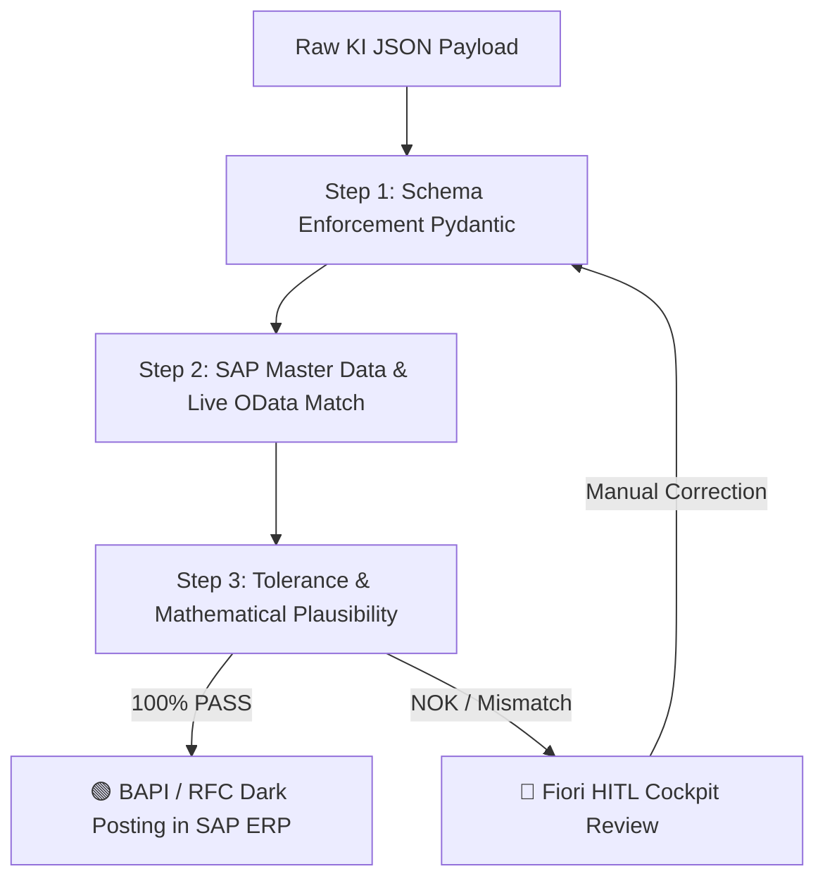

# 📘 SAP AI Enterprise Governance & WAQAM Engine – Comprehensive Architect & Consultant Handbook

**Version 3.5 · Status: July 2026**  
**Publisher: PBD EXPERTS Enterprise Architecture Board**  
**Target Audience: Senior SAP Consultants, Enterprise Architects, CFOs, IT Auditors & Certified Public Accountants**

---

## 📋 Table of Contents
1. [📚 Terminology Index & Glossary (Quick Reference Guide)](#-1-terminology-index--glossary-quick-reference-guide)
2. [🏛️ Strategic Objectives & The 4 WAQAM Operational Modes](#-2-strategic-objectives--the-4-waqam-operational-modes)
3. [🖥️ Detailed Application Walkthrough & UI Control Guide](#-3-detailed-application-walkthrough--ui-control-guide)
   * [3.1 Slide 1: Executive Briefing & Use Case Selection](#31-slide-1-executive-briefing--use-case-selection)
   * [3.2 Slide 2: Visual Process Canvas & SA2 Architecture Blueprint](#32-slide-2-visual-process-canvas--sa2-architecture-blueprint)
   * [3.3 Slide 3: WAQAM Live Simulator & CFO Executive Audit](#33-slide-3-waqam-live-simulator--cfo-executive-audit)
   * [3.4 🛡️ CFO Risk & Governance Popover Modal (Interactive Traffic Lights)](#34--cfo-risk--governance-popover-modal-interactive-traffic-lights)
   * [3.5 💡 Interactive Instant-Hover Tooltips](#35--interactive-instant-hover-tooltips)
   * [3.6 Slide 4: Board Governance Audit Certificate & Target Blueprint](#36-slide-4-board-governance-audit-certificate--target-blueprint)
4. [🛡️ Architecture of the SA2 Validation Gate](#-4-architecture-of-the-sa2-validation-gate)
5. [🧮 Mathematical Engine & Stochastic Confidence Formulas](#-5-mathematical-engine--stochastic-confidence-formulas)
6. [📊 IT Auditor Compliance Guide (IDW PS 880, GoBD, SAP CDHDR/CDPOS)](#-6-it-auditor-compliance-guide-idw-ps-880-gobd-sap-cdhdrcdpos)

---

## 📚 1. Terminology Index & Glossary (Quick Reference Guide)

This glossary serves as a quick reference guide for SAP consultants during client meetings for all abbreviations, architecture concepts, and CFO financial metrics:

### 🧠 AI, Governance & Architecture Terms
* **WAQAM (Workload Architecture & Quality Assessment Model):** The mathematical decision model used to classify AI workloads in SAP environments across 4 operating modes (Class 0 to 3) based on unstructured ratio, SLA latency, and confidence.
* **Validation Gate (Pydantic Rule Check):** Deterministic validation module deployed on SAP BTP. Evaluates AI JSON payloads step-by-step for schema compliance, master data matches, and tolerance thresholds prior to SAP ERP write operations.
* **HITL (Human-in-the-Loop):** Manual review workflow for unconfirmed or risky items via the SAP Fiori My Inbox cockpit (four-eyes principle).
* **Straight-Through Processing (STP / Dunkelverarbeitung):** Percentage of documents that pass the Validation Gate with 100% confidence and are automatically posted to SAP ERP via BAPIs without human intervention.
* **Model Drift:** The phenomenon where external LLMs change behavior following vendor updates. The Validation Gate acts as an absolute firewall preventing SAP ERP re-testing.
* **Multi-LLM Hub:** Abstraction layer on SAP AI Core Orchestration Services. Enables seamless model switching between OpenAI, Claude, Vertex AI, or Llama 3 without code changes in S/4HANA (0% Vendor Lock-in).
* **Zero Data Retention (ZDR):** Contractual guarantee by SAP AI Core that transmitted financial and customer data is erased immediately post-extraction and never utilized for external model training.

### 💰 CFO & Financial Metrics
* **CAPEX (Capital Expenditures):** One-time project and implementation investment for architecture design, BTP Gateway setup, and integration testing.
* **OPEX (Operational Expenditures):** Ongoing monthly maintenance, governance, tenant runtime, and model supervision expenses.
* **Payback Period (Amortization):** Timeframe in months required for net manual labor cost savings to fully offset the initial CAPEX investment.
* **Real Total Cost per Document (€/Booking):** Comprehensive financial processing cost per transaction, calculated as: $(\text{Manual Labor} + \text{LLM Tokens} + \text{Residual Risk} + \text{OPEX}) \div \text{Monthly Volume}$.
* **Residual Risk (Schadenspotenzial):** Expected monthly financial risk exposure resulting from uncaptured edge-case errors after gate processing.

### 🏛️ SAP, Interface & Audit Standards
* **IDW PS 880 / ISAE 3000:** Auditing standards for software products and IT applications required for official audit certification and board release.
* **CDHDR / CDPOS:** Central SAP database tables for change documents, providing an immutable audit trail for every AI automated posting.
* **BAPI (Business Application Programming Interface):** Standardized transactional RFC interface for object-oriented write access to SAP S/4HANA.
* **Clean Core:** SAP architectural guidelines dictating that custom business logic and AI extensions must reside strictly on SAP BTP to preserve S/4HANA ERP upgradeability.

---

## 🏛️ 2. Strategic Objectives & The 4 WAQAM Operational Modes

The **WAQAM (Workload Architecture & Quality Assessment Model)** strictly distinguishes between 4 operating modes. In all operating modes, the Validation Gateway is mandatorily integrated:

| Architecture Class | Name | Functional & Technological Scope | Threshold Triggers |
|---|---|---|---|
| **Class 0** | ⚙️ **Deterministic (ABAP / No-AI)** | Classic SAP ABAP / RPA logic. No AI permitted or required. | SLA latency ≤ 2.0s OR Unstructured ≤ 10% |
| **Class 1** | 🔹 **Point-AI Extraction (1-Step)** | Isolated AI usage for single tasks (e.g., pure OCR text extraction from PDFs), followed by rigid ABAP processing. | Unstructured 11% to 35% |
| **Class 2** | 🟢 **Hybrid-AI (SA2 Enterprise Standard)** | The hybrid enterprise standard. AI models extract data, combined with a deterministic Validation Gate & Fiori HITL cockpit. | Unstructured 36% to 59%, SLA ≥ 2s *(Enterprise Sweet Spot)* |
| **Class 3** | 🟣 **Autonomous Agent (Multi-Step ReAct)** | Autonomous Multi-Step Agents utilizing ReAct tool-loops. Required for high unstructured input complexity. | Unstructured ≥ 60% AND SLA ≥ 6.0s |

---

## 🖥️ 3. Detailed Application Walkthrough & UI Control Guide

### 3.1 Slide 1: Executive Briefing & Use Case Selection
Slide 1 introduces the executive briefing during client workshops. Consultants align with the board on the specific SAP process to transform.

#### 🎛️ UI Controls & Functions on Slide 1:
1. **SAP Core Module Dropdown (Header):** Allows switching between prepared enterprise use cases (e.g. *UC01*, *UC02*, etc.). Instantly loads core module process steps.
2. **Use Case Briefing Card (Left):** Displays business process scope and primary transactional triggers.
3. **AS-IS Baseline & Financial Risk Exposure (Right):** Visualizes manual processing exposure (labor time, internal rate, and historic errors).
4. **Button "Analyze Process Workflow ➔" (Bottom Right):** Navigates directly to Slide 2.

### 3.2 Slide 2: Visual Process Canvas & SA2 Architecture Blueprint
Slide 2 presents the 5-step process workflow and demonstrates how AI components integrate into SAP Clean Core architecture.

#### 🎛️ UI Controls & Functions on Slide 2:
1. **AS-IS Process Chain (Top Flow, 5 Cards):** Displays traditional manual processing steps. Clicking any card highlights its specific AS-IS bottlenecks on the right panel.
2. **TO-BE Target Architecture Canvas (Bottom Flow, 5 Cards with BTP Bridge):** Visualizes automated target workflow leveraging SAP AI Core and the Validation Gate firewall.
3. **Validation Gate Firewall Shield (Highlighted between Steps 2 and 3):** Proves to auditors that AI payloads never write directly to S/4HANA tables without passing deterministic Pydantic verification.
4. **Button "Launch Live ROI Simulator ➔" (Bottom Right):** Navigates to Slide 3.

### 3.3 Slide 3: WAQAM Live Simulator & CFO Executive Audit
Slide 3 is the core analytical engine. Consultants adjust technical and financial parameters live in front of the CFO.

#### 🎛️ UI Controls & Sliders (Left Column):
1. **🏆 Button "Optimal Variant (Sweet Spot)":** 1-click preset applying the standard ROI Class 2 configuration.
2. **🎯 Business Scenario Quick Switches:** One-click parameter adjustments tailored to specific client goals (Max STP, Express, High Precision).
3. **⚙️ Button "Enforce Architecture Boundaries...":** Opens submenu to manually lock Class 0, 1, 2, or 3.
4. **Slider "Monthly Volume (V)":** 1,000 to 100,000 documents/month.
5. **Slider "Unstructured Ratio (U)":** 0% to 100%.
6. **Slider "Prozess-Komplexität (N)":** 3 to 30 rules.
7. **Slider "Ø Positions per Doc (P)":** 1 to 30 positions.
8. **Slider "Max SLA Latency (Sec)":** 1.0s to 30.0s (Latencies ≤ 2.0s force Class 0 ABAP).
9. **Submenu "Adjust Advanced IT Details...":** Data Quality ($Q$), Cost per Error, and Token Price.

> [!NOTE]
> **The methodic parameter design:**
> To ensure objective comparison, all 15 use cases share identical **Standard Client Parameters** (Defaults: 25,000 documents, 50% U, 80% Q, 8s SLA, 5 positions). The functional differentiation is **exclusively** determined by process rule complexity ($N$) and error cost.

#### 📊 Result Cards (Right Column Top):
* **Straight-Through Processing (%):** Calculated automatic processing rate.
* **Real Manual Labor / Mo (€):** Remaining manual review costs in Fiori Inbox.
* **LLM Token Operating Cost / Mo (€):** Pure runtime token cost on SAP AI Core.
* **Real Total Cost / Document (€/Booking):** All-inclusive cost per booking transaction.

#### 🏢 Executive Audit Matrix & Risk Traffic Lights:
* Side-by-side 4-column comparison across all operating modes (Class 0, 1, 2, 3) detailing CAPEX, OPEX, and Payback.
* Traffic Light buttons (`🟢 GREEN`, `🟢/🟡 LOW`, `🟢 SWEET SPOT`, `🔴 HIGH`) open the risk protocol.

### 3.4 🛡️ CFO Risk & Governance Popover Modal (Interactive Traffic Lights)
CFO risk protocol modal content:
* **🟢 SWEET SPOT (Class 2 - Hybrid-AI):** Proves 0% Vendor Lock-in, 100% Model Drift Firewall, and IDW PS 880 compliance via immutable `CDHDR`/`CDPOS` logs.
* **🔴 HIGH (Class 3 - Autonomous Agent):** Warns against unpredictable OPEX, high CAPEX, and auditor compliance concerns regarding GoBD due to dynamic ReAct loops.

### 3.5 💡 Interactive Instant-Hover Tooltips
Hovering over any question mark (`❓`) icon instantly displays a dark help card explaining the parameter's business impact.

### 3.6 Slide 4: Board Governance Audit Certificate & Target Blueprint
Executive summary for board approval. Offers an audit release card, key live metrics, the target 5-step blueprint flow, and a PDF export button.

---

## 🛡️ 4. Architecture of the SA2 Validation Gate

---

## 🧮 5. Mathematical Engine & Stochastic Confidence Formulas

The WAQAM engine simulates straight-through processing, latency, and costs based on a **step-by-step serial stochastic model**. Rather than evaluating the process as a monolith, it simulates the pipeline step by step.

### 5.1 Step-Level Complexity Modeling (4D Model)
Each process step $i$ in the document flow chain is evaluated across 4 dimensions:
1.  **Information Density ($I_i \in [1, 5]$):** Extraction complexity of free texts and fields.
2.  **Rules Complexity ($R_i \in [1, 5]$):** Depth and number of logical branches in this step.
3.  **System Integration ($S_i \in [1, 5]$):** Number of connected systems and API calls (e.g. OData, RFC, REST).
4.  **Cognitive Discretion ($C_i \in [1, 5]$):** Cognitive interpretation overhead for the AI or manual reviewer.

The sum of these dimensions determines the **Step Complexity Index (SCI)**:
$$\text{SCI}_i = I_i + R_i + S_i + C_i \quad \in [4, 20]$$

### 5.2 Step-Level Confidence & Cognitive De-rating
The baseline confidence of the initial extraction is defined by incoming Data Quality ($Q$) and Unstructured Ratio ($U$):
$$\text{mean\_confidence\_base} = Q \cdot 0.70 + (1.0 - U) \cdot 0.30$$

For each step $i$, this confidence is stochastically de-rated by the cognitive factor ($C_i$) and system integration depth ($S_i$):
$$\text{Confidence Modifier}_i = 1.0 - (C_i - 1) \cdot 0.05 - (S_i - 1) \cdot 0.03$$
$$\text{mean\_confidence\_step}_i = \text{mean\_confidence\_base} \cdot \text{Confidence Modifier}_i$$

This determines the step-level AI failure rate:
$$p_{\text{fail\_step}_i} = (1.0 - \text{mean\_confidence\_step}_i) \cdot 0.08$$

### 5.3 Step-Level Implementation Types (`implType`)
Each step features an implementation technology type that controls latency, token consumption, and error rates:

#### A. Deterministic (`deterministic`)
*   Pure code rules (e.g. ABAP check, standard SAP workflow).
*   **Token Cost:** $0.00 \text{ €}$
*   **Failure Probability:** Constant $0.01\%$ (near zero errors).
*   **Latency:** < $0.5\text{s}$.

#### B. Hybrid-AI (`ai`)
*   Isolated AI extraction.
*   **Token Cost:** Standard token usage based on unstructured input.
*   **Failure Probability:** $p_{\text{fail\_step}_i}$.
*   **Latency:** Standard AI execution duration.

#### C. Autonomous Agent (`agentic`)
*   ReAct loops for self-correction and validation.
*   **Token Cost:** 1.8x multiplier on baseline token usage.
*   **Failure Probability:** Significant error reduction through feedback loops:
    *   If rules $N \ge 15$: $p_{\text{fail\_step}_i} \cdot 0.25$ (75% error reduction)
    *   If rules $N < 15$: $p_{\text{fail\_step}_i} \cdot 0.75$ (25% error reduction)
*   **Latency:** Extended execution time (+ $1.5\text{s}$ per step).

### 5.4 Serial Processing Pass Rate (Conservation Law)
The probability of a transaction passing the entire process automatically (STP) is the product of individual step success rates:
$$P_{\text{auto\_pass}} = \prod_{i=1}^{S} (1 - p_{\text{fail\_step}_i})^{\text{checks\_step}_i}$$

Where $\text{checks\_step}_i$ represents the weighted rule checks of step $i$ (divided into header and position rules).

Transactions are stochastically distributed into:
*   **Straight-Through Processing (STP):** $\text{Volume} \cdot P_{\text{auto\_pass}}$
*   **Failure Rate (Residual Risk):** $\text{Volume} \cdot (1.0 - P_{\text{auto\_pass}}) \cdot \text{LeakageRate}$
*   **HITL Routing (Fiori Inbox):** $\text{Volume} \cdot (1.0 - P_{\text{auto\_pass}}) \cdot (1.0 - \text{LeakageRate})$

*Mass conservation is strictly maintained:*
$$\text{Volume} \equiv \text{AutoVolume} + \text{HitlVolume} + \text{ErrorVolume}$$

### 5.5 Economic Feasibility Volume Thresholds (V)
The engine considers financial feasibility alongside technical fit. Low volume operations trigger automatic down-scaling:
*   **$V < 2,000$ (Low Volume):** Downgrades recommendations for Class 2/3 to **Class 0 (No-AI)** (if unstructured ratio $U \le 35\%$) or **Class 1 (Point-AI)**.
*   **$2,000 \le V < 6,000$ (Medium Volume):** Downgrades technical recommendations for Class 3 (Agentic) to **Class 2 (Hybrid-AI)** because the overhead of coordinating an agent does not yet amortize.

---

## 📊 6. IT Auditor Compliance Guide (IDW PS 880, GoBD, SAP CDHDR/CDPOS)

For audits under **IDW PS 880 / ISAE 3000**, the SA2 framework guarantees GoBD compliance through:

1. **Deterministic Pydantic Gate:** No unverified AI output ever accesses database tables directly.
2. **Immutable Audit Trail:** Automated postings generate change documents in SAP tables `CDHDR` and `CDPOS` recording service user IDs and confidence scores.
3. **Zero Data Retention (ZDR):** Contractual SLA guarantees by SAP SE that customer data on BTP Frankfurt is erased immediately post-extraction and never utilized for LLM training.

---
*PBD EXPERTS SA2 Governance Framework · All Rights Reserved 2026*
